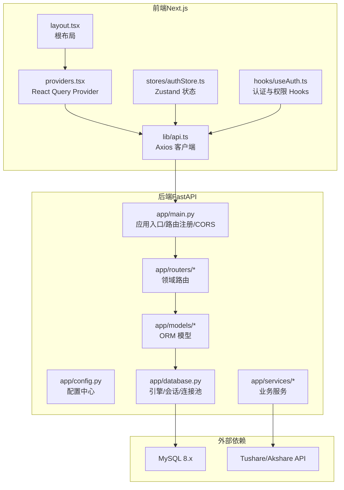
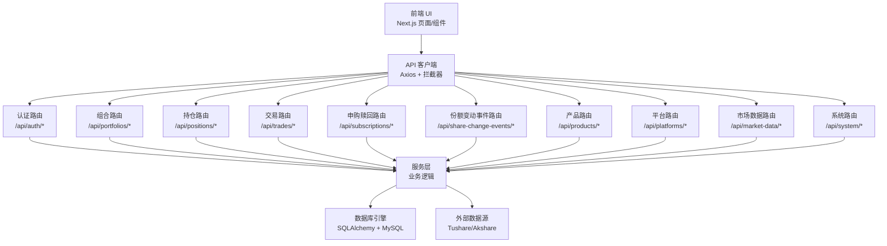
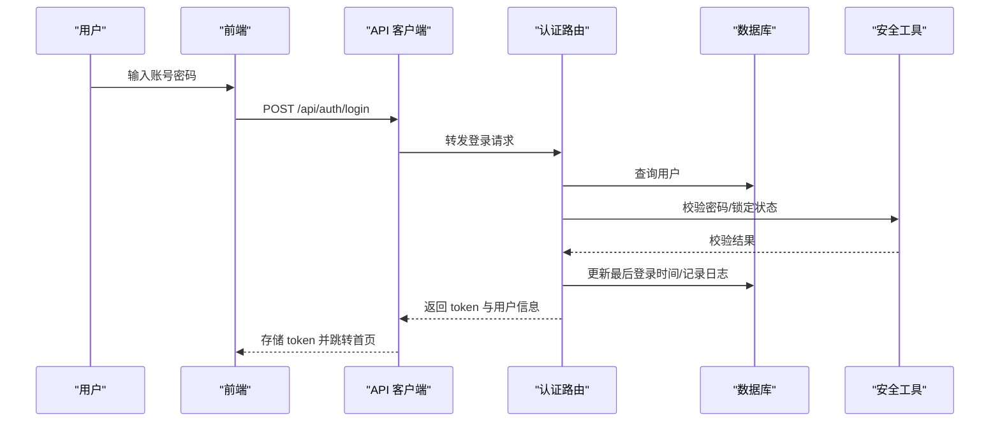
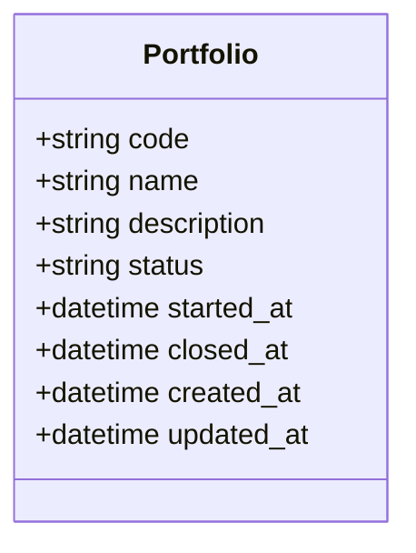
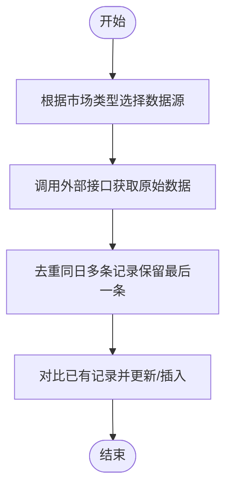
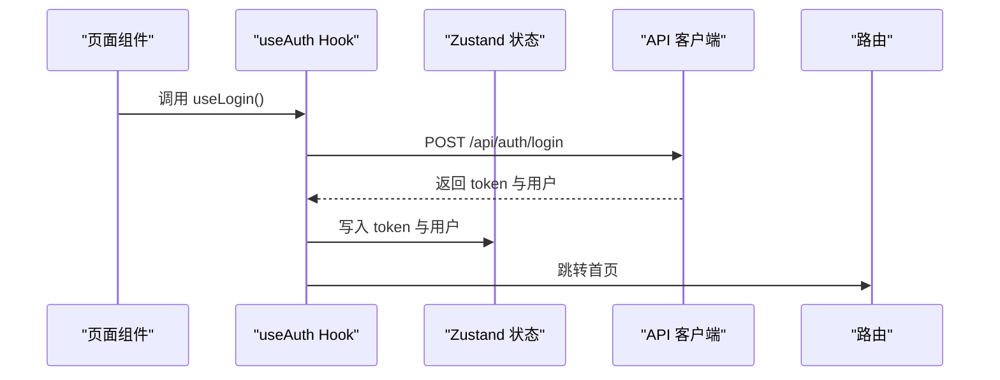
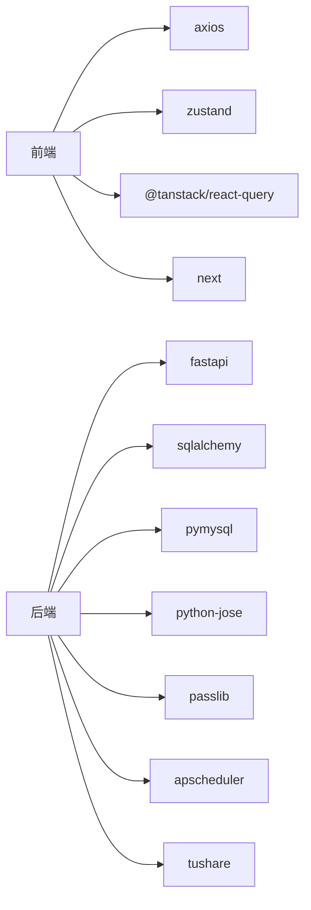

# 系统架构

<cite>
**本文引用的文件**   
- [backend/app/main.py](file://backend/app/main.py)
- [backend/app/config.py](file://backend/app/config.py)
- [backend/app/database.py](file://backend/app/database.py)
- [backend/app/routers/auth.py](file://backend/app/routers/auth.py)
- [backend/app/models/__init__.py](file://backend/app/models/__init__.py)
- [backend/app/models/portfolio.py](file://backend/app/models/portfolio.py)
- [backend/app/services/market_data_service.py](file://backend/app/services/market_data_service.py)
- [backend/requirements.txt](file://backend/requirements.txt)
- [frontend/src/app/layout.tsx](file://frontend/src/app/layout.tsx)
- [frontend/src/app/providers.tsx](file://frontend/src/app/providers.tsx)
- [frontend/src/lib/api.ts](file://frontend/src/lib/api.ts)
- [frontend/src/stores/authStore.ts](file://frontend/src/stores/authStore.ts)
- [frontend/src/hooks/useAuth.ts](file://frontend/src/hooks/useAuth.ts)
- [frontend/package.json](file://frontend/package.json)
- [Docs/00-开发总览.md](file://Docs/00-开发总览.md)
- [Docs/04-后端开发.md](file://Docs/04-后端开发.md)
</cite>

## 目录
1. [简介](#简介)
2. [项目结构](#项目结构)
3. [核心组件](#核心组件)
4. [架构总览](#架构总览)
5. [详细组件分析](#详细组件分析)
6. [依赖分析](#依赖分析)
7. [性能考虑](#性能考虑)
8. [故障排查指南](#故障排查指南)
9. [结论](#结论)
10. [附录](#附录)

## 简介
InvestRing 是一个面向大家庭的家庭投资组合管理系统，采用前后端分离架构：前端使用 Next.js 14 App Router 构建，后端基于 FastAPI 提供 REST API，数据持久化使用 SQLAlchemy + MySQL。系统围绕“净值化管理”“多投资人份额分账”“交易日历与T+1确认”等核心业务展开，提供认证授权、组合管理、持仓管理、交易与份额变动事件、市场数据同步、系统日志与任务管理等能力。

## 项目结构
- 后端（Python/FastAPI）
  - 应用入口与路由注册、中间件、CORS 配置
  - 配置中心（环境变量驱动）
  - 数据库引擎与连接池、会话管理
  - 路由模块（按领域划分）
  - 模型层（SQLAlchemy）
  - 服务层（业务逻辑与外部数据源交互）
- 前端（TypeScript/Next.js）
  - App Router 页面与布局
  - API 客户端（Axios + 拦截器）
  - 状态管理（Zustand + React Query）
  - 类型定义与 Hooks

**图表来源**
- [backend/app/main.py:1-53](file://backend/app/main.py#L1-L53)
- [backend/app/config.py:1-37](file://backend/app/config.py#L1-L37)
- [backend/app/database.py:1-39](file://backend/app/database.py#L1-L39)
- [frontend/src/app/layout.tsx:1-32](file://frontend/src/app/layout.tsx#L1-L32)
- [frontend/src/app/providers.tsx:1-28](file://frontend/src/app/providers.tsx#L1-L28)
- [frontend/src/lib/api.ts:1-627](file://frontend/src/lib/api.ts#L1-L627)
- [frontend/src/stores/authStore.ts:1-71](file://frontend/src/stores/authStore.ts#L1-L71)
- [frontend/src/hooks/useAuth.ts:1-134](file://frontend/src/hooks/useAuth.ts#L1-L134)

**章节来源**
- [backend/app/main.py:1-53](file://backend/app/main.py#L1-L53)
- [backend/app/config.py:1-37](file://backend/app/config.py#L1-L37)
- [backend/app/database.py:1-39](file://backend/app/database.py#L1-L39)
- [frontend/src/app/layout.tsx:1-32](file://frontend/src/app/layout.tsx#L1-L32)
- [frontend/src/app/providers.tsx:1-28](file://frontend/src/app/providers.tsx#L1-L28)
- [frontend/src/lib/api.ts:1-627](file://frontend/src/lib/api.ts#L1-L627)
- [frontend/src/stores/authStore.ts:1-71](file://frontend/src/stores/authStore.ts#L1-L71)
- [frontend/src/hooks/useAuth.ts:1-134](file://frontend/src/hooks/useAuth.ts#L1-L134)

## 核心组件
- 应用入口与路由
  - 注册认证、投资人、组合、产品、平台、交易、份额变动事件、持仓、日志、任务、通知、快照等路由，统一前缀与标签
- 配置中心
  - 通过 pydantic-settings 读取 .env，支持数据库连接、安全密钥、Tushare Token、调试开关
- 数据库层
  - SQLAlchemy 引擎 + 连接池（pool_size、max_overflow、pool_pre_ping、pool_recycle），SQLite 特殊 PRAGMA 配置
  - 会话工厂与依赖注入
- 前端应用
  - 根布局与 PWA 清单
  - React Query Provider（默认缓存策略）
  - Axios 客户端（baseURL、超时、请求/响应拦截器、统一错误处理）
  - Zustand 状态（本地持久化 token 与用户信息）
  - 认证与权限 Hooks（登录、登出、当前用户、角色校验、路由守卫）

**章节来源**
- [backend/app/main.py:32-48](file://backend/app/main.py#L32-L48)
- [backend/app/config.py:5-36](file://backend/app/config.py#L5-L36)
- [backend/app/database.py:7-39](file://backend/app/database.py#L7-L39)
- [frontend/src/app/layout.tsx:8-17](file://frontend/src/app/layout.tsx#L8-L17)
- [frontend/src/app/providers.tsx:7-27](file://frontend/src/app/providers.tsx#L7-L27)
- [frontend/src/lib/api.ts:41-79](file://frontend/src/lib/api.ts#L41-L79)
- [frontend/src/stores/authStore.ts:29-70](file://frontend/src/stores/authStore.ts#L29-L70)
- [frontend/src/hooks/useAuth.ts:11-115](file://frontend/src/hooks/useAuth.ts#L11-L115)

## 架构总览
- 分层架构
  - 表示层（前端 Next.js）：页面、组件、状态与数据请求
  - 业务层（后端 FastAPI + 服务层）：路由处理、权限校验、业务规则、事务控制
  - 数据层（SQLAlchemy + MySQL）：实体建模、查询与写入、连接池与并发
- 集成模式
  - REST API：统一的 HTTP 接口契约，前后端通过 JSON 通信
  - 外部数据源：Tushare/Akshare，按市场类型选择不同接口
- 数据传输协议
  - HTTP/HTTPS，JSON，Bearer Token 认证
- 状态管理策略
  - 前端：Zustand 管理认证态，React Query 管理查询缓存与失效
- 系统边界与外部依赖
  - 边界：前端仅暴露 API 调用；后端暴露 REST 接口；数据库与外部数据源位于边界之外
  - 外部依赖：MySQL、Tushare/Akshare

**图表来源**
- [backend/app/main.py:32-48](file://backend/app/main.py#L32-L48)
- [frontend/src/lib/api.ts:119-624](file://frontend/src/lib/api.ts#L119-L624)

**章节来源**
- [backend/app/main.py:32-48](file://backend/app/main.py#L32-L48)
- [frontend/src/lib/api.ts:119-624](file://frontend/src/lib/api.ts#L119-L624)

## 详细组件分析

### 认证与安全
- 认证流程
  - 登录：校验用户与密码，账户锁定检查，成功生成 Token（含用户角色与过期时间），记录登录日志
  - 登出：解析 Bearer Token 并加入黑名单，记录登出日志
  - 修改密码：权限校验（admin 或本人）、旧密码校验、修改后 Token 失效
- 安全要点
  - 密码使用哈希存储
  - Token 黑名单与过期控制
  - 账户锁定阈值与时间窗
- 前端集成
  - Axios 请求自动附加 Authorization: Bearer token
  - 401 统一跳转登录页
  - Zustand 持久化 token，登录后写入 localStorage 与 Cookie

**图表来源**
- [backend/app/routers/auth.py:29-95](file://backend/app/routers/auth.py#L29-L95)
- [frontend/src/lib/api.ts:50-79](file://frontend/src/lib/api.ts#L50-L79)
- [frontend/src/stores/authStore.ts:37-50](file://frontend/src/stores/authStore.ts#L37-L50)

**章节来源**
- [backend/app/routers/auth.py:29-186](file://backend/app/routers/auth.py#L29-L186)
- [frontend/src/lib/api.ts:50-79](file://frontend/src/lib/api.ts#L50-L79)
- [frontend/src/stores/authStore.ts:29-70](file://frontend/src/stores/authStore.ts#L29-L70)

### 组合与持仓管理
- 组合管理
  - 列表/详情/净值曲线/收益统计/安全日期/手动计算/历史重算/关闭/激活/删除
- 持仓管理
  - 持仓列表（支持历史快照日期查询）、收益归因、可用现金（实时计算）
- 数据模型
  - 组合实体（状态、起止时间、创建更新时间）

**图表来源**
- [backend/app/models/portfolio.py:5-16](file://backend/app/models/portfolio.py#L5-L16)

**章节来源**
- [backend/app/models/portfolio.py:5-16](file://backend/app/models/portfolio.py#L5-L16)
- [Docs/04-后端开发.md:125-229](file://Docs/04-后端开发.md#L125-L229)
- [Docs/04-后端开发.md:232-308](file://Docs/04-后端开发.md#L232-L308)

### 市场数据与外部集成
- 服务层职责
  - 查询/同步产品价格与净值，按市场类型选择不同外部接口
  - 去重与一致性处理，异常捕获与返回
- 外部数据源
  - CN_EXCHANGE：Tushare 基金日线（收盘价）
  - CN_OTC：Tushare 基金净值
- 限流与稳定性
  - 通过服务层实现限流与分页拉取，避免超量返回

**图表来源**
- [backend/app/services/market_data_service.py:88-200](file://backend/app/services/market_data_service.py#L88-L200)

**章节来源**
- [backend/app/services/market_data_service.py:15-200](file://backend/app/services/market_data_service.py#L15-L200)
- [Docs/04-后端开发.md:650-700](file://Docs/04-后端开发.md#L650-L700)

### 前端状态与数据流
- 状态管理
  - Zustand 管理 token 与用户信息，支持持久化
  - React Query 管理查询缓存（staleTime、refetchOnWindowFocus、retry）
- API 客户端
  - 自动附加 Authorization 头
  - 统一错误处理与 401 跳转
- 认证 Hooks
  - 登录/登出/当前用户/角色校验/路由守卫

**图表来源**
- [frontend/src/hooks/useAuth.ts:17-35](file://frontend/src/hooks/useAuth.ts#L17-L35)
- [frontend/src/stores/authStore.ts:37-50](file://frontend/src/stores/authStore.ts#L37-L50)
- [frontend/src/lib/api.ts:120-129](file://frontend/src/lib/api.ts#L120-L129)

**章节来源**
- [frontend/src/app/providers.tsx:7-27](file://frontend/src/app/providers.tsx#L7-L27)
- [frontend/src/lib/api.ts:41-79](file://frontend/src/lib/api.ts#L41-L79)
- [frontend/src/stores/authStore.ts:29-70](file://frontend/src/stores/authStore.ts#L29-L70)
- [frontend/src/hooks/useAuth.ts:11-115](file://frontend/src/hooks/useAuth.ts#L11-L115)

## 依赖分析
- 后端依赖
  - Web 框架：FastAPI
  - ORM：SQLAlchemy
  - 数据库：MySQL（pymysql）
  - 安全与加密：python-jose、passlib
  - 调度与任务：APScheduler
  - 外部数据：tushare
  - 工具：httpx、pandas、numpy、python-dateutil、alembic
- 前端依赖
  - 框架：Next.js
  - 状态：Zustand、@tanstack/react-query
  - UI：shadcn/ui + TailwindCSS
  - 网络：axios
  - 图表：recharts
  - 日期：date-fns

**图表来源**
- [backend/requirements.txt:1-19](file://backend/requirements.txt#L1-L19)
- [frontend/package.json:11-39](file://frontend/package.json#L11-L39)

**章节来源**
- [backend/requirements.txt:1-19](file://backend/requirements.txt#L1-L19)
- [frontend/package.json:11-39](file://frontend/package.json#L11-L39)

## 性能考虑
- 连接池与并发
  - 后端连接池参数（pool_size、max_overflow、pool_pre_ping、pool_recycle）提升并发与连接复用效率
  - SQLite 使用 WAL 模式与 PRAGMA 调优，改善并发与可靠性
- 查询缓存
  - 前端 React Query 默认缓存策略（staleTime、retry），减少重复请求
- 外部数据同步
  - 服务层实现限流与分页，避免超量返回与接口限流触发
- 传输与序列化
  - JSON 传输，FastAPI 自动生成 OpenAPI 文档，便于前端对接与缓存策略制定

**章节来源**
- [backend/app/database.py:7-39](file://backend/app/database.py#L7-L39)
- [frontend/src/app/providers.tsx:10-18](file://frontend/src/app/providers.tsx#L10-L18)
- [backend/app/services/market_data_service.py:126-145](file://backend/app/services/market_data_service.py#L126-L145)

## 故障排查指南
- 常见问题定位
  - 认证失败：检查用户名/密码、账户锁定状态、Token 是否过期或被加入黑名单
  - 401 未授权：确认前端是否正确附加 Authorization 头，localStorage 是否存在 token
  - 数据同步异常：查看外部数据源返回与服务层异常处理，关注限流与去重逻辑
  - 数据库连接问题：检查连接池参数、数据库可达性、字符集与时区
- 前端调试
  - 使用 React DevTools 检查 Zustand 状态与 React Query 缓存
  - 在网络面板观察请求头与响应状态码
- 后端调试
  - 查看路由注册与中间件（CORS、日志）
  - 检查数据库引擎与会话生命周期

**章节来源**
- [frontend/src/lib/api.ts:67-79](file://frontend/src/lib/api.ts#L67-L79)
- [frontend/src/stores/authStore.ts:37-50](file://frontend/src/stores/authStore.ts#L37-L50)
- [backend/app/main.py:23-30](file://backend/app/main.py#L23-L30)
- [backend/app/database.py:33-39](file://backend/app/database.py#L33-L39)

## 结论
InvestRing 采用清晰的前后端分离架构，后端以 FastAPI + SQLAlchemy 构建 REST API，前端以 Next.js + Zustand + React Query 实现高效的数据与状态管理。系统围绕净值化管理与交易日历构建核心业务流程，通过外部数据源（Tushare/Akshare）实现市场数据同步，并以连接池、查询缓存与限流策略保障性能与稳定性。认证与安全机制覆盖密码哈希、Token 黑名单、账户锁定与角色权限，满足家庭场景下的安全与合规要求。

## 附录
- 技术选型与架构决策依据
  - 前端：Next.js App Router 提供现代路由与 SSR/SSG 能力；Zustand + React Query 平衡轻量与强缓存
  - 后端：FastAPI 提供高性能与自动生成文档；SQLAlchemy 适配复杂业务与关系建模
  - 数据库：MySQL 8.x 作为主存储，连接池与字符集配置确保高并发与国际化
  - 外部数据：Tushare/Akshare 满足国内公募基金数据需求，服务层统一接入与限流
- 系统边界与第三方集成点
  - 系统边界：前端仅负责 API 调用；后端负责业务与数据；数据库与外部数据源位于边界之外
  - 第三方集成：Tushare/Akshare 通过服务层封装，避免路由层直连

**章节来源**
- [Docs/00-开发总览.md:16-46](file://Docs/00-开发总览.md#L16-L46)
- [Docs/04-后端开发.md:50-69](file://Docs/04-后端开发.md#L50-L69)