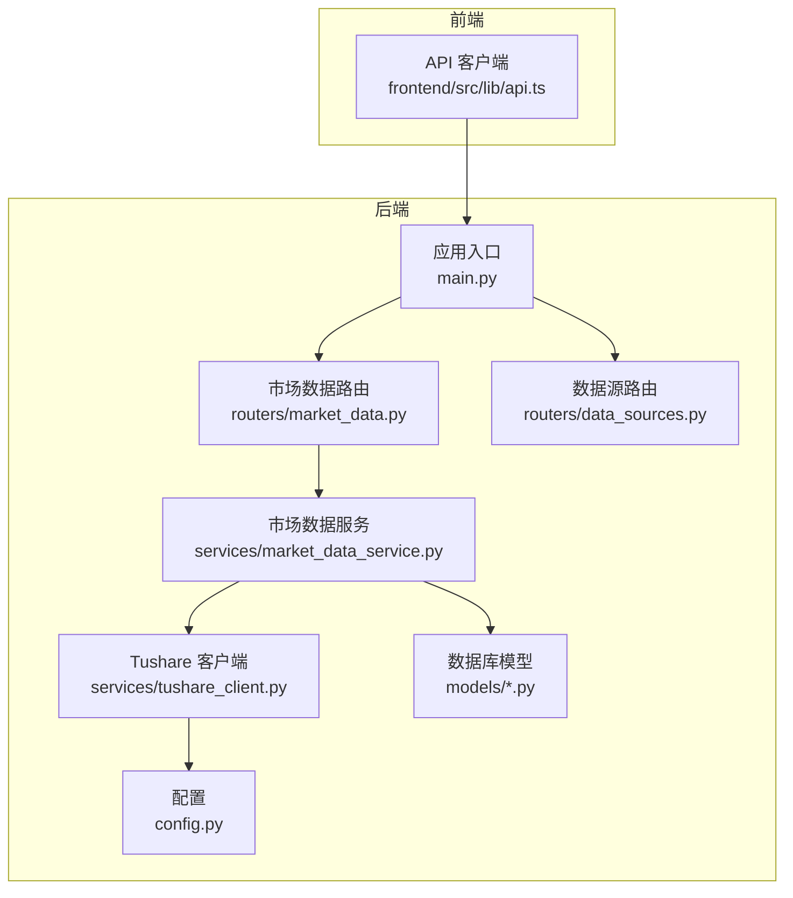
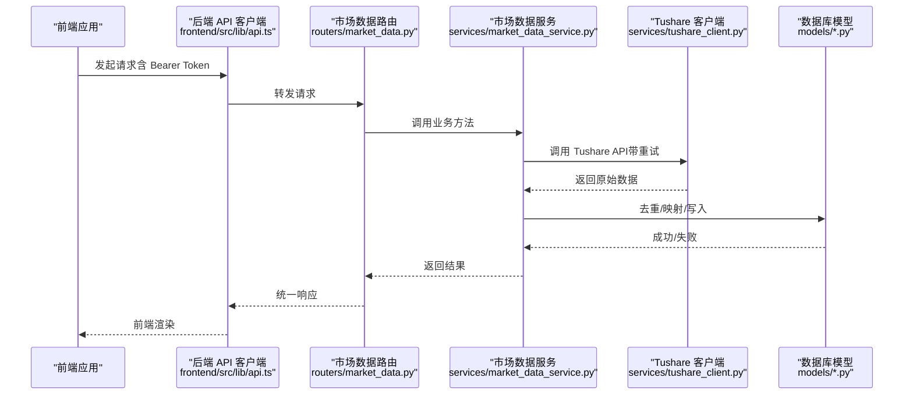
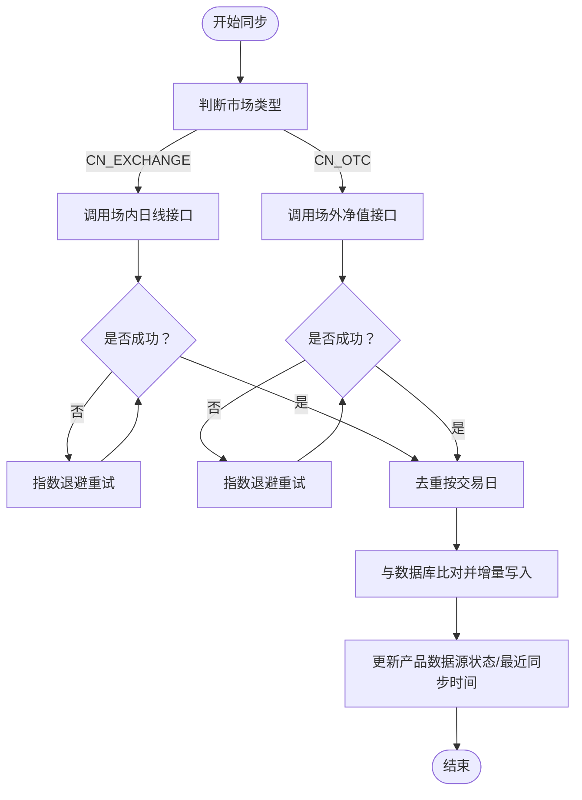
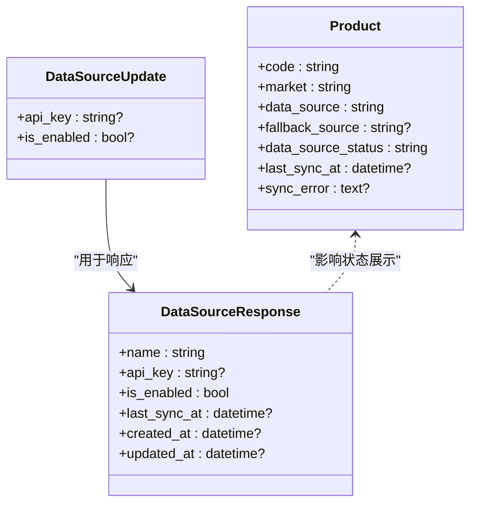
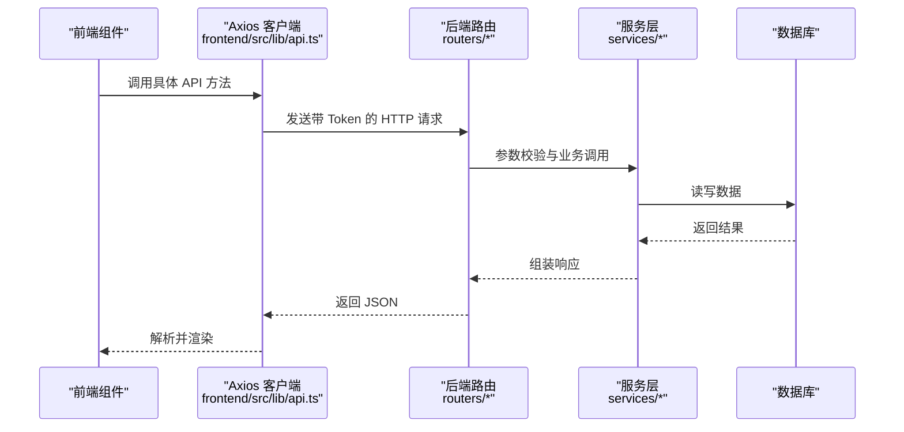
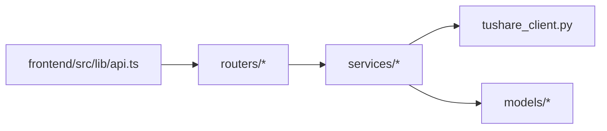

# 集成模式

<cite>
**本文引用的文件**
- [backend/app/services/tushare_client.py](file://backend/app/services/tushare_client.py)
- [backend/app/services/market_data_service.py](file://backend/app/services/market_data_service.py)
- [backend/app/routers/market_data.py](file://backend/app/routers/market_data.py)
- [backend/app/routers/data_sources.py](file://backend/app/routers/data_sources.py)
- [backend/app/schemas/data_source.py](file://backend/app/schemas/data_source.py)
- [backend/app/schemas/market_data.py](file://backend/app/schemas/market_data.py)
- [backend/app/models/product.py](file://backend/app/models/product.py)
- [backend/app/models/price_record.py](file://backend/app/models/price_record.py)
- [backend/app/models/trading_calendar.py](file://backend/app/models/trading_calendar.py)
- [backend/app/config.py](file://backend/app/config.py)
- [backend/app/main.py](file://backend/app/main.py)
- [frontend/src/lib/api.ts](file://frontend/src/lib/api.ts)
</cite>

## 目录
1. [引言](#引言)
2. [项目结构](#项目结构)
3. [核心组件](#核心组件)
4. [架构总览](#架构总览)
5. [详细组件分析](#详细组件分析)
6. [依赖分析](#依赖分析)
7. [性能考虑](#性能考虑)
8. [故障排查指南](#故障排查指南)
9. [结论](#结论)
10. [附录](#附录)

## 引言
本文件面向 InvestRing 的“集成模式”主题，系统化阐述平台与外部服务（尤其是 Tushare 金融数据 API）的集成策略、数据同步机制、认证与错误处理、前端与后端的 API 通信协议与数据传输格式，并给出安全、性能监控与故障隔离建议。同时覆盖平台集成、数据源配置与多数据源支持方案，以及插件化扩展与向后兼容性设计思路。

## 项目结构
后端采用 FastAPI + SQLAlchemy 架构，按功能模块组织路由与服务层；前端使用 Next.js + TypeScript + Axios，通过统一的 API 客户端封装与拦截器实现认证与错误处理。系统通过路由器暴露 REST 接口，服务层负责业务逻辑与第三方 API 调用，模型层定义数据表结构与约束。

**图表来源**
- [backend/app/main.py:1-53](file://backend/app/main.py#L1-L53)
- [backend/app/routers/market_data.py:1-112](file://backend/app/routers/market_data.py#L1-L112)
- [backend/app/routers/data_sources.py:1-150](file://backend/app/routers/data_sources.py#L1-L150)
- [backend/app/services/market_data_service.py:1-323](file://backend/app/services/market_data_service.py#L1-L323)
- [backend/app/services/tushare_client.py:1-222](file://backend/app/services/tushare_client.py#L1-L222)
- [backend/app/config.py:1-37](file://backend/app/config.py#L1-L37)
- [backend/app/models/product.py:1-22](file://backend/app/models/product.py#L1-L22)
- [backend/app/models/price_record.py:1-28](file://backend/app/models/price_record.py#L1-L28)
- [backend/app/models/trading_calendar.py:1-13](file://backend/app/models/trading_calendar.py#L1-L13)
- [frontend/src/lib/api.ts:1-627](file://frontend/src/lib/api.ts#L1-L627)

**章节来源**
- [backend/app/main.py:1-53](file://backend/app/main.py#L1-L53)
- [frontend/src/lib/api.ts:1-627](file://frontend/src/lib/api.ts#L1-L627)

## 核心组件
- Tushare 客户端：封装 Tushare Pro SDK 调用，提供交易日历、场内基金日线、场外基金净值等接口，内置重试与错误分类。
- 市场数据服务：聚合产品、价格记录、组合净值等业务逻辑，协调 Tushare 客户端与数据库持久化。
- 路由器（市场数据/数据源）：暴露 REST 接口，处理参数校验、异常映射与响应格式。
- 数据模型：定义产品、价格记录、交易日历等核心实体及约束。
- 前端 API 客户端：统一请求/响应拦截、Token 注入、错误处理与分页封装。

**章节来源**
- [backend/app/services/tushare_client.py:1-222](file://backend/app/services/tushare_client.py#L1-L222)
- [backend/app/services/market_data_service.py:1-323](file://backend/app/services/market_data_service.py#L1-L323)
- [backend/app/routers/market_data.py:1-112](file://backend/app/routers/market_data.py#L1-L112)
- [backend/app/routers/data_sources.py:1-150](file://backend/app/routers/data_sources.py#L1-L150)
- [backend/app/models/product.py:1-22](file://backend/app/models/product.py#L1-L22)
- [backend/app/models/price_record.py:1-28](file://backend/app/models/price_record.py#L1-L28)
- [backend/app/models/trading_calendar.py:1-13](file://backend/app/models/trading_calendar.py#L1-L13)
- [frontend/src/lib/api.ts:1-627](file://frontend/src/lib/api.ts#L1-L627)

## 架构总览
系统以“路由 → 服务 → 第三方 API/数据库”的分层方式组织，Tushare 作为 CN_EXCHANGE/CN_OTC 市场数据的主要来源，通过服务层进行去重、字段映射与持久化。前端通过 Axios 客户端访问后端 API，统一处理鉴权与错误。

**图表来源**
- [frontend/src/lib/api.ts:1-627](file://frontend/src/lib/api.ts#L1-L627)
- [backend/app/routers/market_data.py:1-112](file://backend/app/routers/market_data.py#L1-L112)
- [backend/app/services/market_data_service.py:1-323](file://backend/app/services/market_data_service.py#L1-L323)
- [backend/app/services/tushare_client.py:1-222](file://backend/app/services/tushare_client.py#L1-L222)
- [backend/app/models/price_record.py:1-28](file://backend/app/models/price_record.py#L1-L28)

## 详细组件分析

### Tushare 集成与数据同步机制
- 认证与初始化
  - 通过环境变量加载 TUSHARE_TOKEN，若缺失抛出未配置错误。
  - 提供交易日历、场内基金日线、场外基金净值三类接口。
- 调用限制与重试
  - 对关键接口采用指数退避重试（最多 3 次），缓解第三方限流与瞬时错误。
- 错误处理
  - 区分“未配置”“API 调用失败”两类异常，便于前端与运维定位。
- 数据同步流程
  - 服务层根据市场类型选择不同 Tushare 接口，去重后与数据库现有记录对比，增量更新或新增，最终更新产品数据源状态与最近同步时间。

**图表来源**
- [backend/app/services/tushare_client.py:48-121](file://backend/app/services/tushare_client.py#L48-L121)
- [backend/app/services/tushare_client.py:123-221](file://backend/app/services/tushare_client.py#L123-L221)
- [backend/app/services/market_data_service.py:88-225](file://backend/app/services/market_data_service.py#L88-L225)

**章节来源**
- [backend/app/services/tushare_client.py:13-46](file://backend/app/services/tushare_client.py#L13-L46)
- [backend/app/services/tushare_client.py:48-121](file://backend/app/services/tushare_client.py#L48-L121)
- [backend/app/services/tushare_client.py:123-221](file://backend/app/services/tushare_client.py#L123-L221)
- [backend/app/services/market_data_service.py:88-225](file://backend/app/services/market_data_service.py#L88-L225)

### 多数据源支持与配置
- 当前支持的数据源
  - Tushare：需配置 TUSHARE_TOKEN，启用状态取决于是否配置了 Token。
  - AkShare：无需 Token，通过环境变量开关启用/禁用。
- 配置读取与更新
  - 列表接口从环境与数据库读取配置并脱敏显示。
  - 更新接口写入 .env 文件并即时更新运行时环境变量。
- 数据源状态与回退
  - 产品模型包含 data_source、fallback_source、data_source_status、last_sync_at 等字段，用于记录与追踪数据源状态。

**图表来源**
- [backend/app/schemas/data_source.py:6-24](file://backend/app/schemas/data_source.py#L6-L24)
- [backend/app/models/product.py:5-22](file://backend/app/models/product.py#L5-L22)
- [backend/app/routers/data_sources.py:24-60](file://backend/app/routers/data_sources.py#L24-L60)
- [backend/app/routers/data_sources.py:77-118](file://backend/app/routers/data_sources.py#L77-L118)

**章节来源**
- [backend/app/routers/data_sources.py:24-60](file://backend/app/routers/data_sources.py#L24-L60)
- [backend/app/routers/data_sources.py:77-118](file://backend/app/routers/data_sources.py#L77-L118)
- [backend/app/schemas/data_source.py:6-24](file://backend/app/schemas/data_source.py#L6-L24)
- [backend/app/models/product.py:5-22](file://backend/app/models/product.py#L5-L22)

### 前端与后端集成模式
- 通信协议与数据传输
  - 前端基于 Axios，统一设置 Content-Type 为 application/json，超时 30 秒。
  - 后端路由返回 JSON，错误通过 HTTP 状态码与 detail 字段传递。
- 认证与拦截器
  - 请求拦截器自动附加 Bearer Token（来自本地存储）。
  - 响应拦截器统一处理 401（跳转登录）、其他错误转换为统一异常对象。
- API 方法映射
  - 前端将各领域 API 封装为命名空间，如产品、组合、交易、份额变动事件、快照等。
  - 路由器提供明确的路径与方法，如 GET /products/{code}、POST /products/{code}/{market}/sync-price-data 等。

**图表来源**
- [frontend/src/lib/api.ts:41-79](file://frontend/src/lib/api.ts#L41-L79)
- [frontend/src/lib/api.ts:109-117](file://frontend/src/lib/api.ts#L109-L117)
- [backend/app/routers/market_data.py:17-41](file://backend/app/routers/market_data.py#L17-L41)
- [backend/app/routers/market_data.py:43-68](file://backend/app/routers/market_data.py#L43-L68)

**章节来源**
- [frontend/src/lib/api.ts:1-627](file://frontend/src/lib/api.ts#L1-L627)
- [backend/app/routers/market_data.py:1-112](file://backend/app/routers/market_data.py#L1-L112)

### 数据模型与一致性
- 价格记录表
  - 主键自增，唯一约束为 (product_code, market, date)，避免重复写入。
  - 存储单位净值、累计净值、前收盘、涨跌幅、来源等字段。
- 产品表
  - 记录产品代码、市场、数据源、状态、最近同步时间等。
- 交易日历表
  - 唯一日期索引，记录每个交易日是否开放。

```mermaid
erDiagram
PRODUCT {
string code PK
string market PK
string name
string product_type
string data_source
string data_source_status
datetime last_sync_at
}
PRICE_RECORD {
int id PK
string product_code
string market
date date
numeric unit_price
numeric accumulated_nav
numeric pre_close
numeric pct_change
string source
}
TRADING_CALENDAR {
int id PK
date date UK
boolean is_open
string exchange
}
PRODUCT ||--o{ PRICE_RECORD : "拥有"
```

**图表来源**
- [backend/app/models/product.py:5-22](file://backend/app/models/product.py#L5-L22)
- [backend/app/models/price_record.py:5-28](file://backend/app/models/price_record.py#L5-L28)
- [backend/app/models/trading_calendar.py:5-13](file://backend/app/models/trading_calendar.py#L5-L13)

**章节来源**
- [backend/app/models/price_record.py:1-28](file://backend/app/models/price_record.py#L1-L28)
- [backend/app/models/product.py:1-22](file://backend/app/models/product.py#L1-L22)
- [backend/app/models/trading_calendar.py:1-13](file://backend/app/models/trading_calendar.py#L1-L13)

### 插件化架构与扩展点设计
- 路由与服务解耦
  - 路由器仅负责参数与响应，业务逻辑集中在服务层，便于替换第三方数据源实现。
- 数据源抽象
  - 产品模型包含 data_source/fallback_source/status 等字段，为未来引入 AkShare 等其他数据源提供扩展点。
- 配置即代码
  - 数据源配置通过 .env 文件与数据库状态联动，支持运行时开关与审计。

**章节来源**
- [backend/app/routers/data_sources.py:24-60](file://backend/app/routers/data_sources.py#L24-L60)
- [backend/app/models/product.py:5-22](file://backend/app/models/product.py#L5-L22)

### 向后兼容性保障
- 路由版本控制
  - 快照相关接口使用 /api/v1 前缀，便于后续版本演进。
- 响应结构稳定
  - 使用 Pydantic 模型定义响应结构，确保字段名与类型稳定。
- 错误处理一致
  - 统一的 HTTP 状态码与 detail 字段，便于前端兼容旧版错误解析。

**章节来源**
- [backend/app/main.py:48-48](file://backend/app/main.py#L48-L48)
- [backend/app/schemas/market_data.py:6-19](file://backend/app/schemas/market_data.py#L6-L19)

## 依赖分析
- 组件耦合
  - 路由器依赖服务层；服务层依赖 Tushare 客户端与数据库模型；前端仅依赖后端路由。
- 外部依赖
  - Tushare SDK、SQLAlchemy、FastAPI、Axios。
- 循环依赖
  - 未发现循环导入；模块职责清晰。

**图表来源**
- [frontend/src/lib/api.ts:1-627](file://frontend/src/lib/api.ts#L1-L627)
- [backend/app/routers/market_data.py:1-112](file://backend/app/routers/market_data.py#L1-L112)
- [backend/app/services/market_data_service.py:1-323](file://backend/app/services/market_data_service.py#L1-L323)
- [backend/app/services/tushare_client.py:1-222](file://backend/app/services/tushare_client.py#L1-L222)
- [backend/app/models/price_record.py:1-28](file://backend/app/models/price_record.py#L1-L28)

**章节来源**
- [backend/app/routers/market_data.py:1-112](file://backend/app/routers/market_data.py#L1-L112)
- [backend/app/services/market_data_service.py:1-323](file://backend/app/services/market_data_service.py#L1-L323)
- [backend/app/services/tushare_client.py:1-222](file://backend/app/services/tushare_client.py#L1-L222)
- [frontend/src/lib/api.ts:1-627](file://frontend/src/lib/api.ts#L1-L627)

## 性能考虑
- 调用重试与退避
  - Tushare 接口采用指数退避重试，降低瞬时失败对吞吐的影响。
- 数据去重与批量写入
  - 同步前对同一天多条记录去重，减少数据库写入次数。
- 分页与限制
  - 前端查询默认限制返回条数，避免大范围扫描。
- 缓存与状态
  - 产品表记录 data_source_status 与 last_sync_at，便于前端快速判断可用性与时效。

**章节来源**
- [backend/app/services/tushare_client.py:69-86](file://backend/app/services/tushare_client.py#L69-L86)
- [backend/app/services/market_data_service.py:147-209](file://backend/app/services/market_data_service.py#L147-L209)
- [frontend/src/lib/api.ts:23-23](file://frontend/src/lib/api.ts#L23-L23)

## 故障排查指南
- Tushare 未配置
  - 现象：调用报错提示未配置 Token。
  - 处理：在 .env 中设置 TUSHARE_TOKEN 并重启服务。
- API 调用失败
  - 现象：出现 TushareAPIError，包含原始异常信息。
  - 处理：检查网络、Token 有效性与接口参数；查看重试日志。
- 数据写入异常
  - 现象：同步成功但写入数据库失败，产品状态变为 failed。
  - 处理：检查数据库连接、唯一约束冲突与字段类型。
- 前端 401
  - 现象：自动跳转登录。
  - 处理：重新登录获取 Token 并保存至本地存储。

**章节来源**
- [backend/app/services/tushare_client.py:38-45](file://backend/app/services/tushare_client.py#L38-L45)
- [backend/app/services/market_data_service.py:135-138](file://backend/app/services/market_data_service.py#L135-L138)
- [backend/app/services/market_data_service.py:210-214](file://backend/app/services/market_data_service.py#L210-L214)
- [frontend/src/lib/api.ts:70-79](file://frontend/src/lib/api.ts#L70-L79)

## 结论
InvestRing 通过清晰的分层架构与明确的扩展点，实现了与 Tushare 的稳健集成。服务层承担业务编排与错误治理，前端以统一客户端屏蔽协议细节。当前已具备多数据源配置能力与基础回退机制，建议后续引入更完善的任务调度、指标采集与熔断降级策略，进一步提升稳定性与可观测性。

## 附录
- 关键接口一览
  - 获取产品价格数据：GET /api/market-data/products/{code}/{market}/price-data
  - 同步产品价格数据：POST /api/market-data/products/{code}/{market}/sync-price-data
  - 同步历史数据：POST /api/market-data/products/{code}/{market}/sync-history
  - 获取数据源配置：GET /api/system/data-sources
  - 更新数据源配置：PUT /api/system/data-sources/{name}

**章节来源**
- [backend/app/routers/market_data.py:17-93](file://backend/app/routers/market_data.py#L17-L93)
- [backend/app/routers/data_sources.py:63-118](file://backend/app/routers/data_sources.py#L63-L118)