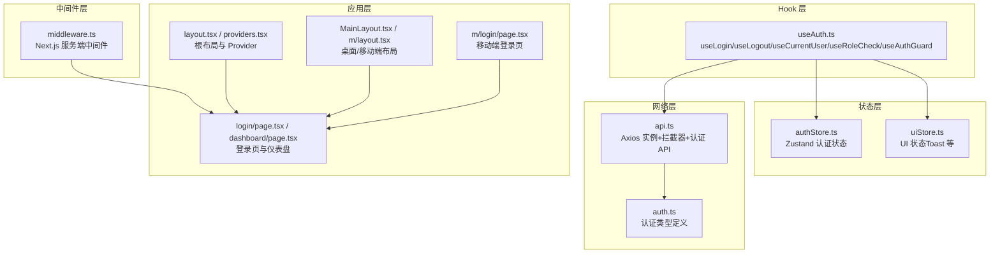
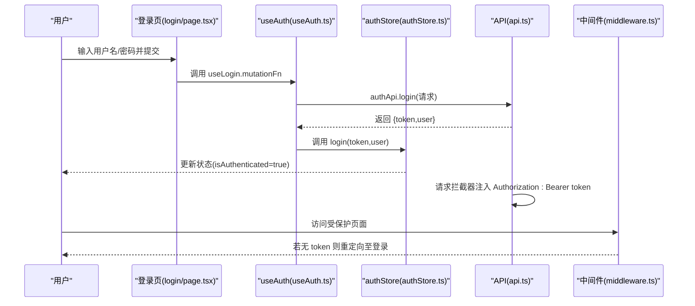
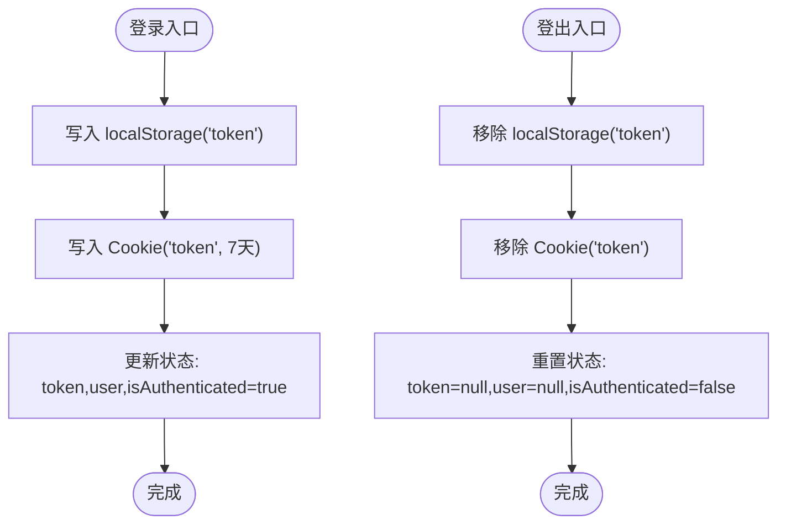
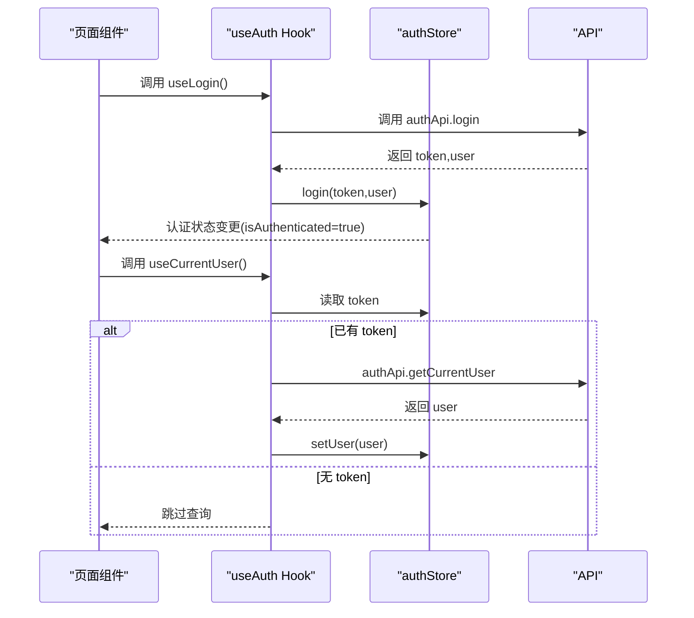
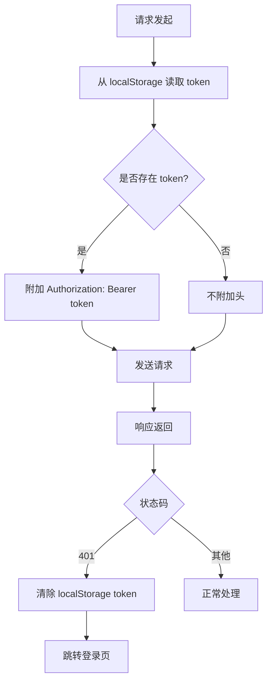
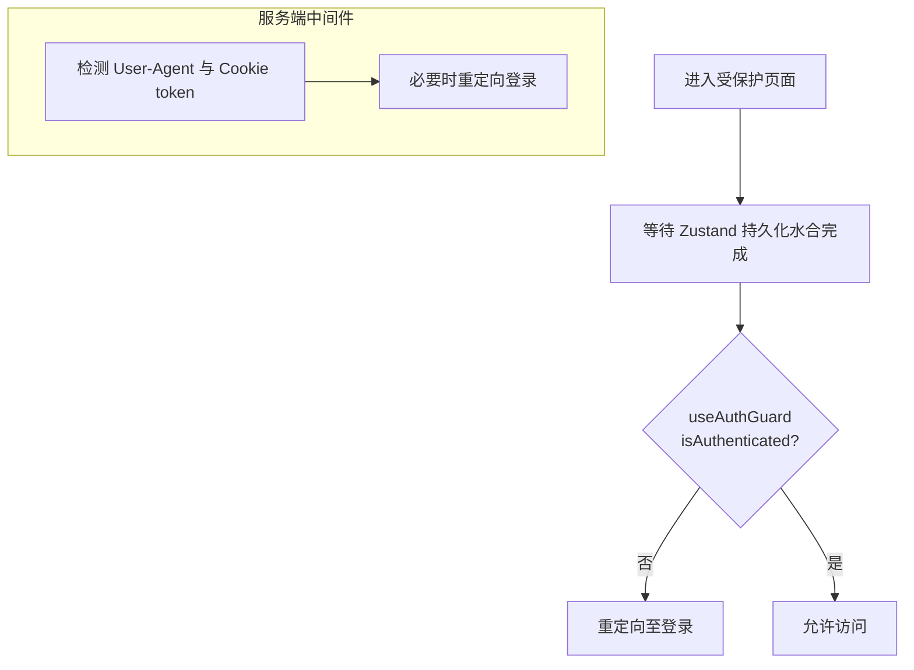
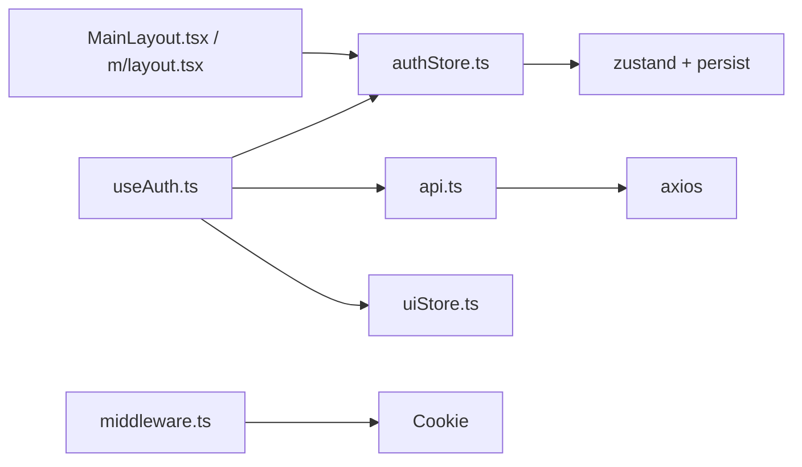

# 前端认证状态管理

<cite>
**本文引用的文件**
- [frontend/src/stores/authStore.ts](file://frontend/src/stores/authStore.ts)
- [frontend/src/hooks/useAuth.ts](file://frontend/src/hooks/useAuth.ts)
- [frontend/src/lib/api.ts](file://frontend/src/lib/api.ts)
- [frontend/src/types/auth.ts](file://frontend/src/types/auth.ts)
- [frontend/src/middleware.ts](file://frontend/src/middleware.ts)
- [frontend/src/app/providers.tsx](file://frontend/src/app/providers.tsx)
- [frontend/src/app/layout.tsx](file://frontend/src/app/layout.tsx)
- [frontend/src/components/layout/MainLayout.tsx](file://frontend/src/components/layout/MainLayout.tsx)
- [frontend/src/app/login/page.tsx](file://frontend/src/app/login/page.tsx)
- [frontend/src/app/dashboard/page.tsx](file://frontend/src/app/dashboard/page.tsx)
- [frontend/src/app/m/layout.tsx](file://frontend/src/app/m/layout.tsx)
- [frontend/src/app/m/login/page.tsx](file://frontend/src/app/m/login/page.tsx)
- [frontend/package.json](file://frontend/package.json)
</cite>

## 更新摘要
**变更内容**
- 登录页面增强了令牌有效性检查，确保在子路径部署环境下正确处理用户认证流程
- 改进了导航逻辑使用完整路径构造，避免相对路径导致的重定向问题
- 优化了认证状态检查时机，确保在 Zustand 状态持久化完成后才进行认证检查
- 修复了 issue #68 中用户在全页加载时被错误重定向到 /login 的问题

## 目录
1. [简介](#简介)
2. [项目结构](#项目结构)
3. [核心组件](#核心组件)
4. [架构总览](#架构总览)
5. [详细组件分析](#详细组件分析)
6. [依赖关系分析](#依赖关系分析)
7. [性能考量](#性能考量)
8. [故障排查指南](#故障排查指南)
9. [结论](#结论)
10. [附录](#附录)

## 简介
本文件面向前端开发者，系统性阐述 InvestRing 前端认证状态管理的设计与实现，重点覆盖以下方面：
- Zustand 状态管理在认证中的应用：authStore 的状态结构、动作函数与持久化策略
- 自定义 Hook useAuth 的职责边界：登录、登出、当前用户信息拉取、权限校验、路由守卫
- Token 存储与传输：localStorage 与 Cookie 双存储策略、请求拦截器自动注入
- 错误处理与安全：401 统一跳转、异常封装与提示
- 与路由守卫的集成：服务端中间件与客户端守卫协同实现页面访问控制
- 用户体验优化：加载态、防抖与错误反馈
- 常见问题与最佳实践：Token 刷新、跨域、移动端适配等

## 项目结构
前端认证相关代码主要分布在以下模块：
- 状态层：Zustand Store（authStore）与 UI Store（uiStore）
- Hook 层：useAuth（登录、登出、当前用户、权限、守卫）
- 网络层：Axios 实例与拦截器（api.ts），认证 API 封装
- 类型层：认证相关接口类型（auth.ts）
- 中间件层：Next.js 服务端中间件（middleware.ts）
- 应用层：根布局与页面（layout.tsx、login/page.tsx、dashboard/page.tsx、mobile 版本）
- 依赖声明：package.json 中的 Zustand、React Query、Axios 等

图表来源
- [frontend/src/stores/authStore.ts:1-71](file://frontend/src/stores/authStore.ts#L1-L71)
- [frontend/src/hooks/useAuth.ts:1-134](file://frontend/src/hooks/useAuth.ts#L1-L134)
- [frontend/src/lib/api.ts:1-627](file://frontend/src/lib/api.ts#L1-L627)
- [frontend/src/types/auth.ts:1-23](file://frontend/src/types/auth.ts#L1-L23)
- [frontend/src/middleware.ts:1-40](file://frontend/src/middleware.ts#L1-L40)
- [frontend/src/app/layout.tsx:1-32](file://frontend/src/app/layout.tsx#L1-L32)
- [frontend/src/app/providers.tsx:1-28](file://frontend/src/app/providers.tsx#L1-L28)
- [frontend/src/components/layout/MainLayout.tsx:1-41](file://frontend/src/components/layout/MainLayout.tsx#L1-L41)
- [frontend/src/app/login/page.tsx:1-101](file://frontend/src/app/login/page.tsx#L1-L101)
- [frontend/src/app/dashboard/page.tsx:1-290](file://frontend/src/app/dashboard/page.tsx#L1-L290)
- [frontend/src/app/m/layout.tsx:1-27](file://frontend/src/app/m/layout.tsx#L1-L27)
- [frontend/src/app/m/login/page.tsx:1-7](file://frontend/src/app/m/login/page.tsx#L1-L7)

章节来源
- [frontend/src/stores/authStore.ts:1-71](file://frontend/src/stores/authStore.ts#L1-L71)
- [frontend/src/hooks/useAuth.ts:1-134](file://frontend/src/hooks/useAuth.ts#L1-L134)
- [frontend/src/lib/api.ts:1-627](file://frontend/src/lib/api.ts#L1-L627)
- [frontend/src/types/auth.ts:1-23](file://frontend/src/types/auth.ts#L1-L23)
- [frontend/src/middleware.ts:1-40](file://frontend/src/middleware.ts#L1-L40)
- [frontend/src/app/layout.tsx:1-32](file://frontend/src/app/layout.tsx#L1-L32)
- [frontend/src/app/providers.tsx:1-28](file://frontend/src/app/providers.tsx#L1-L28)
- [frontend/src/components/layout/MainLayout.tsx:1-41](file://frontend/src/components/layout/MainLayout.tsx#L1-L41)
- [frontend/src/app/login/page.tsx:1-101](file://frontend/src/app/login/page.tsx#L1-L101)
- [frontend/src/app/dashboard/page.tsx:1-290](file://frontend/src/app/dashboard/page.tsx#L1-L290)
- [frontend/src/app/m/layout.tsx:1-27](file://frontend/src/app/m/layout.tsx#L1-L27)
- [frontend/src/app/m/login/page.tsx:1-7](file://frontend/src/app/m/login/page.tsx#L1-L7)

## 核心组件
- Zustand 认证 Store（authStore）
  - 状态字段：token、user、isAuthenticated、isLoading
  - 动作函数：login、logout、setUser、setLoading
  - 持久化：通过 persist 中间件将 token、user、isAuthenticated 同步到本地存储
  - Cookie 同步：登录时写入 localStorage 与 Cookie；登出时清理两者
- 自定义 Hook（useAuth）
  - useLogin：触发登录 API，成功后写入状态并跳转
  - useLogout：清空状态、清理缓存、提示并跳转
  - useCurrentUser：启用条件查询当前用户，带缓存时间
  - useAuthGuard：根据认证状态与 requireAuth 参数进行路由跳转
  - useRoleCheck：基于用户角色返回管理员/查看者标识与角色检查函数
- 网络层（api.ts）
  - Axios 实例：统一基础配置与超时
  - 请求拦截器：从 localStorage 读取 token 并注入 Authorization 头
  - 响应拦截器：401 统一清除 token 并跳转登录
  - 异常封装：统一错误对象与消息映射
  - 认证 API：login、changePassword、getCurrentUser
- 类型定义（auth.ts）
  - LoginRequest/LoginResponse/UserInfo/ChangePasswordRequest
- 服务端中间件（middleware.ts）
  - 移动端/桌面端路径重定向
  - 未携带 token 且非登录页时强制跳转登录
- 应用层
  - 根布局与 Provider：初始化 React Query 与全局 Toast
  - 登录页与仪表盘：登录成功后跳转仪表盘
  - 布局组件：未认证时自动跳转登录

**更新** 登录页面增强了令牌有效性检查，确保在子路径部署环境下正确处理用户认证流程和重定向。改进了导航逻辑使用完整路径构造，避免了相对路径导致的重定向问题。

章节来源
- [frontend/src/stores/authStore.ts:18-71](file://frontend/src/stores/authStore.ts#L18-L71)
- [frontend/src/hooks/useAuth.ts:11-134](file://frontend/src/hooks/useAuth.ts#L11-L134)
- [frontend/src/lib/api.ts:41-129](file://frontend/src/lib/api.ts#L41-L129)
- [frontend/src/types/auth.ts:1-23](file://frontend/src/types/auth.ts#L1-L23)
- [frontend/src/middleware.ts:4-36](file://frontend/src/middleware.ts#L4-L36)
- [frontend/src/app/providers.tsx:7-27](file://frontend/src/app/providers.tsx#L7-L27)
- [frontend/src/app/login/page.tsx:14-101](file://frontend/src/app/login/page.tsx#L14-L101)
- [frontend/src/app/dashboard/page.tsx:12-290](file://frontend/src/app/dashboard/page.tsx#L12-L290)
- [frontend/src/components/layout/MainLayout.tsx:10-41](file://frontend/src/components/layout/MainLayout.tsx#L10-L41)
- [frontend/src/app/m/layout.tsx:8-27](file://frontend/src/app/m/layout.tsx#L8-L27)
- [frontend/src/app/m/login/page.tsx:1-7](file://frontend/src/app/m/login/page.tsx#L1-L7)

## 架构总览
下图展示认证状态管理在前端的整体交互：用户在登录页输入凭据 → 调用认证 API → 成功后写入 Zustand 状态与本地存储 → 请求拦截器自动附加 Token → 仪表盘渲染 → 401 时统一处理。

图表来源
- [frontend/src/app/login/page.tsx:22-43](file://frontend/src/app/login/page.tsx#L22-L43)
- [frontend/src/hooks/useAuth.ts:17-36](file://frontend/src/hooks/useAuth.ts#L17-L36)
- [frontend/src/stores/authStore.ts:37-51](file://frontend/src/stores/authStore.ts#L37-L51)
- [frontend/src/lib/api.ts:50-79](file://frontend/src/lib/api.ts#L50-L79)
- [frontend/src/middleware.ts:29-33](file://frontend/src/middleware.ts#L29-L33)

## 详细组件分析

### Zustand 认证状态管理（authStore）
- 状态结构
  - token：字符串或空，作为鉴权凭证
  - user：用户信息对象或空
  - isAuthenticated：布尔值，表示是否已认证
  - isLoading：布尔值，表示认证过程中的加载态
- 动作函数
  - login：写入 token 与 Cookie，同时设置用户与已认证状态
  - logout：移除 token 与 Cookie，重置认证状态
  - setUser：更新当前用户信息
  - setLoading：切换加载态
- 持久化策略
  - 使用 persist 中间件，仅持久化 token、user、isAuthenticated
  - 通过 partialize 控制序列化字段，避免持久化不必要的状态
- Cookie 同步
  - 登录时写入 localStorage 与 Cookie（默认有效期 7 天）
  - 登出时同时删除 localStorage 与 Cookie

图表来源
- [frontend/src/stores/authStore.ts:37-51](file://frontend/src/stores/authStore.ts#L37-L51)
- [frontend/src/stores/authStore.ts:61-69](file://frontend/src/stores/authStore.ts#L61-L69)

章节来源
- [frontend/src/stores/authStore.ts:18-71](file://frontend/src/stores/authStore.ts#L18-L71)

### 自定义 Hook（useAuth）
- useLogin
  - 调用认证 API，成功后调用 authStore.login 写入状态
  - 成功提示与跳转至仪表盘
  - 失败提示（用户名/密码错误）
- useLogout
  - 清理 authStore 状态与 React Query 缓存
  - 提示"已退出登录"，跳转至登录页
- useCurrentUser
  - 条件查询：当存在 token 时才发起请求
  - 缓存时间：5 分钟，避免频繁拉取
  - 成功后通过 setUser 更新用户信息
- useAuthGuard
  - 根据 requireAuth 参数决定是否需要认证
  - 当处于加载态时不做跳转
  - 不满足要求时重定向至登录或仪表盘
- useRoleCheck
  - 返回 isAdmin/isViewer 与当前角色
  - 提供 checkRole 函数用于细粒度权限判断

图表来源
- [frontend/src/hooks/useAuth.ts:17-36](file://frontend/src/hooks/useAuth.ts#L17-L36)
- [frontend/src/hooks/useAuth.ts:61-71](file://frontend/src/hooks/useAuth.ts#L61-L71)
- [frontend/src/stores/authStore.ts:37-59](file://frontend/src/stores/authStore.ts#L37-L59)

章节来源
- [frontend/src/hooks/useAuth.ts:11-134](file://frontend/src/hooks/useAuth.ts#L11-L134)

### Token 存储策略与自动注入
- 存储策略
  - localStorage：持久化 token，用于请求拦截器读取
  - Cookie：同步写入与删除，便于服务端中间件读取 token
- 自动注入
  - 请求拦截器：从 localStorage 读取 token 并附加到 Authorization 头
  - 响应拦截器：捕获 401，清除 localStorage 中的 token 并跳转登录
- 类型与 API
  - LoginResponse 包含 token 与用户信息
  - 认证 API：login、changePassword、getCurrentUser

图表来源
- [frontend/src/lib/api.ts:50-79](file://frontend/src/lib/api.ts#L50-L79)
- [frontend/src/types/auth.ts:6-10](file://frontend/src/types/auth.ts#L6-L10)

章节来源
- [frontend/src/lib/api.ts:41-129](file://frontend/src/lib/api.ts#L41-L129)
- [frontend/src/types/auth.ts:1-23](file://frontend/src/types/auth.ts#L1-L23)

### 路由守卫与页面访问控制
- 服务端中间件（middleware.ts）
  - 自动识别移动端/桌面端并做路径重定向
  - 未携带 token 且非登录页时强制跳转登录
- 客户端守卫（useAuthGuard）
  - 结合 authStore 的 isAuthenticated 与 isLoading
  - 支持 requireAuth 参数，灵活控制访问规则
- 布局守卫（MainLayout / m/layout）
  - 在客户端侧再次校验认证状态，确保安全

**更新** MainLayout 组件现在正确处理 Zustand 持久化水合过程，确保在状态完全加载后才执行认证检查，避免了 issue #68 中描述的全页加载时错误重定向问题。

图表来源
- [frontend/src/middleware.ts:4-36](file://frontend/src/middleware.ts#L4-L36)
- [frontend/src/hooks/useAuth.ts:96-115](file://frontend/src/hooks/useAuth.ts#L96-L115)
- [frontend/src/components/layout/MainLayout.tsx:18-22](file://frontend/src/components/layout/MainLayout.tsx#L18-L22)
- [frontend/src/app/m/layout.tsx:16-20](file://frontend/src/app/m/layout.tsx#L16-L20)

章节来源
- [frontend/src/middleware.ts:1-40](file://frontend/src/middleware.ts#L1-L40)
- [frontend/src/hooks/useAuth.ts:96-115](file://frontend/src/hooks/useAuth.ts#L96-L115)
- [frontend/src/components/layout/MainLayout.tsx:10-41](file://frontend/src/components/layout/MainLayout.tsx#L10-L41)
- [frontend/src/app/m/layout.tsx:8-27](file://frontend/src/app/m/layout.tsx#L8-L27)

### 页面与用户体验
- 登录页（desktop/mobile）
  - 表单校验与错误提示
  - 加载态与按钮禁用
- 仪表盘
  - 数据懒加载与骨架屏
  - 交易与组合状态提示
- Provider
  - 初始化 React Query 默认选项（如缓存时间、窗口焦点重取、重试次数）

**更新** 登录页面增强了令牌有效性检查，确保在子路径部署环境下正确处理用户认证流程和重定向。改进了导航逻辑使用完整路径构造，显著提升了用户体验，消除了之前因过早认证检查导致的页面闪烁和错误跳转问题。

章节来源
- [frontend/src/app/login/page.tsx:14-101](file://frontend/src/app/login/page.tsx#L14-L101)
- [frontend/src/app/dashboard/page.tsx:12-290](file://frontend/src/app/dashboard/page.tsx#L12-L290)
- [frontend/src/app/providers.tsx:7-27](file://frontend/src/app/providers.tsx#L7-L27)

## 依赖关系分析
- 状态依赖
  - useAuth 依赖 authStore 与 uiStore（Toast）
  - authStore 依赖 Zustand 与 persist 中间件
- 网络依赖
  - useAuth 依赖 api.ts 的 authApi
  - api.ts 依赖 Axios 与自定义异常封装
- 应用依赖
  - middleware.ts 依赖 Next.js 请求上下文与 Cookie
  - 布局组件依赖 authStore 与路由

图表来源
- [frontend/src/hooks/useAuth.ts:1-10](file://frontend/src/hooks/useAuth.ts#L1-L10)
- [frontend/src/stores/authStore.ts:1-3](file://frontend/src/stores/authStore.ts#L1-L3)
- [frontend/src/lib/api.ts:1-10](file://frontend/src/lib/api.ts#L1-L10)
- [frontend/src/middleware.ts:8](file://frontend/src/middleware.ts#L8)
- [frontend/src/components/layout/MainLayout.tsx:5](file://frontend/src/components/layout/MainLayout.tsx#L5)
- [frontend/src/app/m/layout.tsx:5](file://frontend/src/app/m/layout.tsx#L5)

章节来源
- [frontend/src/package.json:11-38](file://frontend/package.json#L11-L38)

## 性能考量
- 缓存与去抖
  - useCurrentUser 设置了 5 分钟的缓存时间，减少重复请求
  - React Query 默认缓存时间与重试策略已在 Provider 中配置
- 加载态
  - authStore 的 isLoading 与 useAuthGuard 的条件跳转避免重复导航
- 请求拦截器
  - 仅在客户端环境读取 token，避免服务端 SSR 期间访问浏览器 API
- 持久化水合优化
  - MainLayout 组件现在等待 Zustand 持久化水合完成后再进行认证检查，减少了不必要的重定向和状态闪烁

**更新** 通过优化认证检查时机和改进导航逻辑，显著改善了首次页面加载的性能表现，避免了因过早检查导致的不必要网络请求和状态更新。

章节来源
- [frontend/src/hooks/useAuth.ts:69](file://frontend/src/hooks/useAuth.ts#L69)
- [frontend/src/app/providers.tsx:10-18](file://frontend/src/app/providers.tsx#L10-L18)
- [frontend/src/lib/api.ts:53-59](file://frontend/src/lib/api.ts#L53-L59)

## 故障排查指南
- 登录失败
  - 检查 useLogin 的错误提示逻辑与 API 返回
  - 确认服务端返回的 LoginResponse 结构一致
- 401 未跳转
  - 确认响应拦截器是否生效（仅在客户端环境）
  - 检查 localStorage 是否被清理
- 页面无法访问
  - 检查服务端中间件是否正确读取 Cookie
  - 检查 useAuthGuard 的 requireAuth 参数与路由匹配
- Token 不一致
  - 确认登录时是否同时写入 localStorage 与 Cookie
  - 确认登出时是否同时删除两者
- **新增** 全页加载时错误重定向
  - 确认 MainLayout 组件是否正确处理 Zustand 持久化水合
  - 检查认证检查是否在状态完全加载后执行
  - 验证 isLoading 状态的正确使用
- **新增** 子路径部署环境问题
  - 确认导航逻辑使用完整路径构造而非相对路径
  - 检查令牌有效性检查逻辑是否正确处理子路径场景
  - 验证重定向逻辑在不同部署环境下的兼容性

**更新** 新增了针对子路径部署环境的故障排查指导，帮助用户解决认证流程和重定向相关问题。

章节来源
- [frontend/src/hooks/useAuth.ts:28-35](file://frontend/src/hooks/useAuth.ts#L28-L35)
- [frontend/src/lib/api.ts:67-79](file://frontend/src/lib/api.ts#L67-L79)
- [frontend/src/middleware.ts:8](file://frontend/src/middleware.ts#L8)
- [frontend/src/stores/authStore.ts:37-51](file://frontend/src/stores/authStore.ts#L37-L51)

## 结论
InvestRing 前端认证体系以 Zustand 为核心，结合 React Query、Axios 拦截器与 Next.js 中间件，实现了：
- 明确的状态模型与持久化策略
- 完整的登录/登出/权限/守卫链路
- 统一的错误处理与安全机制
- 良好的用户体验与可维护性

**更新** 最新修复解决了登录页面的令牌有效性检查和导航逻辑问题，确保了在子路径部署环境下的正确行为。通过改进认证检查时机和优化导航逻辑，显著提升了用户体验，避免了全页加载时的错误重定向。建议后续扩展方向：Token 自动刷新、多租户/多角色细化、移动端更严格的会话管理。

## 附录
- 关键实现位置参考
  - 认证状态与动作：[frontend/src/stores/authStore.ts:18-71](file://frontend/src/stores/authStore.ts#L18-L71)
  - 登录/登出/守卫/Hook：[frontend/src/hooks/useAuth.ts:11-134](file://frontend/src/hooks/useAuth.ts#L11-L134)
  - 请求/响应拦截与 API：[frontend/src/lib/api.ts:41-129](file://frontend/src/lib/api.ts#L41-L129)
  - 类型定义：[frontend/src/types/auth.ts:1-23](file://frontend/src/types/auth.ts#L1-L23)
  - 服务端中间件：[frontend/src/middleware.ts:1-40](file://frontend/src/middleware.ts#L1-L40)
  - 根布局与 Provider：[frontend/src/app/layout.tsx:1-32](file://frontend/src/app/layout.tsx#L1-L32), [frontend/src/app/providers.tsx:1-28](file://frontend/src/app/providers.tsx#L1-L28)
  - 登录页与仪表盘：[frontend/src/app/login/page.tsx:1-101](file://frontend/src/app/login/page.tsx#L1-L101), [frontend/src/app/dashboard/page.tsx:1-290](file://frontend/src/app/dashboard/page.tsx#L1-L290)
  - 布局守卫：[frontend/src/components/layout/MainLayout.tsx:1-41](file://frontend/src/components/layout/MainLayout.tsx#L1-L41), [frontend/src/app/m/layout.tsx:1-27](file://frontend/src/app/m/layout.tsx#L1-L27)