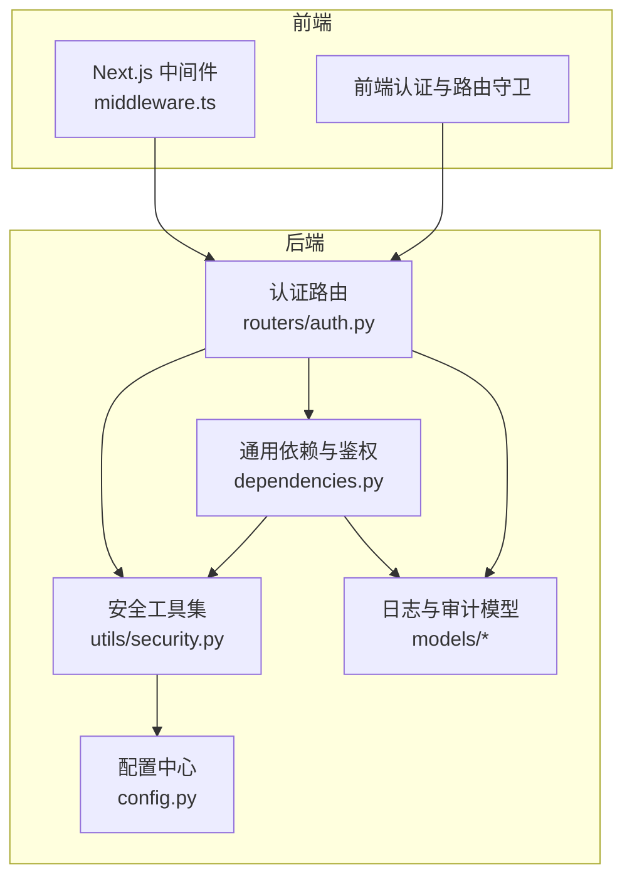
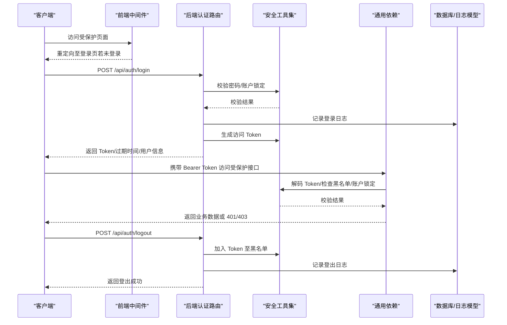
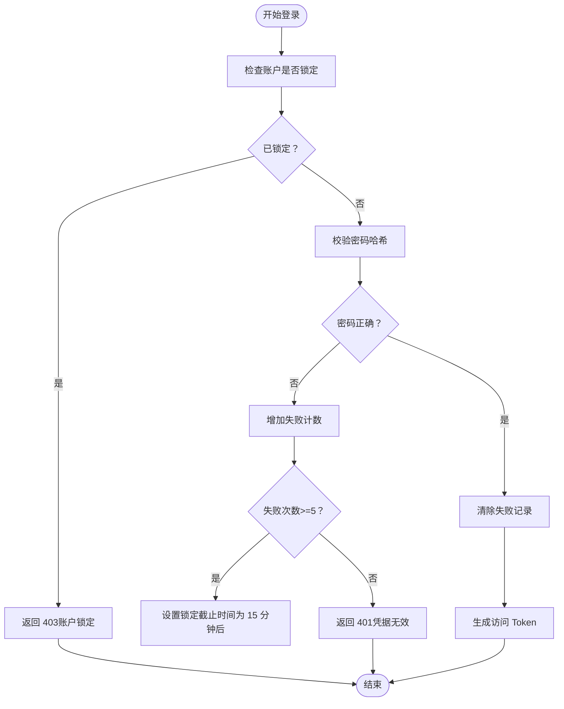
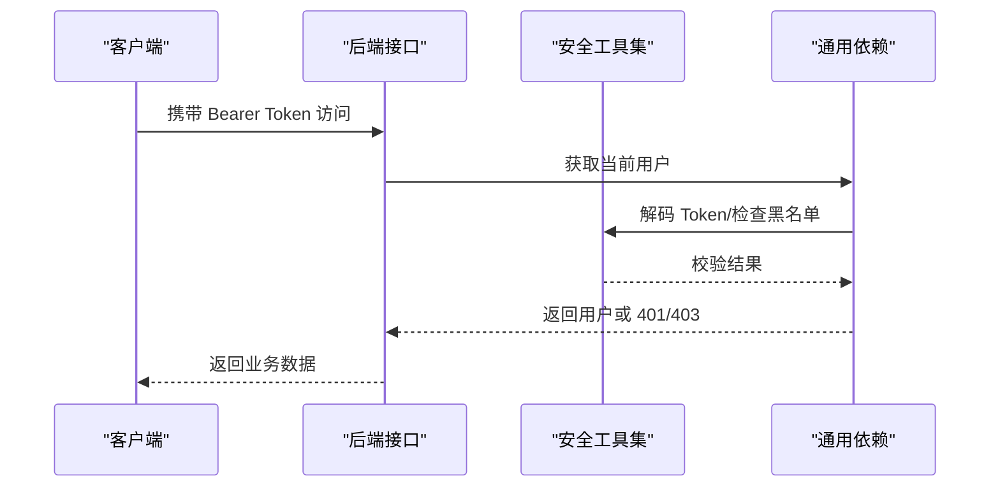
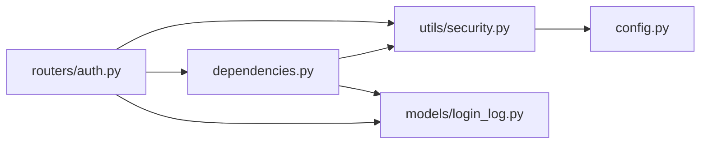

# 安全最佳实践与威胁防护

<cite>
**本文引用的文件**
- [backend/app/config.py](file://backend/app/config.py)
- [backend/app/utils/security.py](file://backend/app/utils/security.py)
- [backend/app/routers/auth.py](file://backend/app/routers/auth.py)
- [backend/app/dependencies.py](file://backend/app/dependencies.py)
- [backend/app/models/login_log.py](file://backend/app/models/login_log.py)
- [backend/app/models/audit_log.py](file://backend/app/models/audit_log.py)
- [backend/app/models/system_error_log.py](file://backend/app/models/system_error_log.py)
- [backend/app/models/task_execution_log.py](file://backend/app/models/task_execution_log.py)
- [frontend/src/middleware.ts](file://frontend/src/middleware.ts)
- [Docs/07-日志系统设计.md](file://Docs/07-日志系统设计.md)
- [Docs/05-前端开发.md](file://Docs/05-前端开发.md)
- [Docs/init_data.sql](file://Docs/init_data.sql)
</cite>

## 目录
1. [简介](#简介)
2. [项目结构](#项目结构)
3. [核心组件](#核心组件)
4. [架构总览](#架构总览)
5. [详细组件分析](#详细组件分析)
6. [依赖分析](#依赖分析)
7. [性能考虑](#性能考虑)
8. [故障排查指南](#故障排查指南)
9. [结论](#结论)
10. [附录](#附录)

## 简介
本文件面向安全管理员与开发者，系统性梳理 InvestRing 的安全现状与最佳实践，覆盖暴力破解防护、会话劫持防护、CSRF 防护与 XSS 防护；明确安全配置项（Token 过期时间、登录失败锁定阈值、安全日志策略）；给出安全审计机制、异常检测与入侵防护建议；制定安全事件响应流程、应急处理预案与监控指标；并提供安全测试方法、漏洞扫描与渗透测试指南，帮助团队建立可落地的风险评估与治理框架。

## 项目结构
InvestRing 采用前后端分离架构，后端基于 FastAPI，前端基于 Next.js。安全相关能力主要集中在后端认证授权与日志审计模块，前端提供路由守卫与 Token 管理。

图表来源
- [frontend/src/middleware.ts:1-40](file://frontend/src/middleware.ts#L1-L40)
- [backend/app/config.py:1-37](file://backend/app/config.py#L1-L37)
- [backend/app/utils/security.py:1-103](file://backend/app/utils/security.py#L1-L103)
- [backend/app/routers/auth.py:1-186](file://backend/app/routers/auth.py#L1-L186)
- [backend/app/dependencies.py:1-146](file://backend/app/dependencies.py#L1-L146)
- [backend/app/models/login_log.py:1-16](file://backend/app/models/login_log.py#L1-L16)
- [backend/app/models/audit_log.py:1-18](file://backend/app/models/audit_log.py#L1-L18)

章节来源
- [frontend/src/middleware.ts:1-40](file://frontend/src/middleware.ts#L1-L40)
- [backend/app/config.py:1-37](file://backend/app/config.py#L1-L37)
- [backend/app/utils/security.py:1-103](file://backend/app/utils/security.py#L1-L103)
- [backend/app/routers/auth.py:1-186](file://backend/app/routers/auth.py#L1-L186)
- [backend/app/dependencies.py:1-146](file://backend/app/dependencies.py#L1-L146)
- [backend/app/models/login_log.py:1-16](file://backend/app/models/login_log.py#L1-L16)
- [backend/app/models/audit_log.py:1-18](file://backend/app/models/audit_log.py#L1-L18)

## 核心组件
- 配置中心：集中管理密钥与 Token 过期时间等安全参数。
- 安全工具集：提供密码哈希、JWT 编解码、Token 黑名单、登录失败追踪与账户锁定判定。
- 认证路由：登录、登出、改密流程，集成登录日志与审计日志记录。
- 通用依赖：统一鉴权中间件，校验 Token、黑名单、账户锁定状态。
- 日志与审计：登录日志、操作审计日志、系统错误日志、任务执行日志等。

章节来源
- [backend/app/config.py:14-16](file://backend/app/config.py#L14-L16)
- [backend/app/utils/security.py:15-102](file://backend/app/utils/security.py#L15-L102)
- [backend/app/routers/auth.py:29-185](file://backend/app/routers/auth.py#L29-L185)
- [backend/app/dependencies.py:49-111](file://backend/app/dependencies.py#L49-L111)
- [backend/app/models/login_log.py:5-15](file://backend/app/models/login_log.py#L5-L15)
- [backend/app/models/audit_log.py:5-17](file://backend/app/models/audit_log.py#L5-L17)

## 架构总览
下图展示登录与会话生命周期中的关键安全交互：

图表来源
- [frontend/src/middleware.ts:30-33](file://frontend/src/middleware.ts#L30-L33)
- [backend/app/routers/auth.py:29-119](file://backend/app/routers/auth.py#L29-L119)
- [backend/app/utils/security.py:29-54](file://backend/app/utils/security.py#L29-L54)
- [backend/app/dependencies.py:49-111](file://backend/app/dependencies.py#L49-L111)
- [backend/app/models/login_log.py:5-15](file://backend/app/models/login_log.py#L5-L15)

## 详细组件分析

### 暴力破解防护
- 登录失败追踪与临时锁定
  - 使用内存字典记录每个投资人的失败次数与锁定截止时间，超过阈值（默认 5 次）进行 15 分钟锁定。
  - 锁定期间拒绝登录请求，并返回明确的锁定截止时间。
- 密码存储与校验
  - 使用强哈希算法对密码进行存储；登录时进行哈希比对，避免明文泄露。
- 登录日志
  - 记录登录成功/失败、IP、UA、失败原因等，支撑审计与风控。

图表来源
- [backend/app/utils/security.py:57-81](file://backend/app/utils/security.py#L57-L81)
- [backend/app/routers/auth.py:37-72](file://backend/app/routers/auth.py#L37-L72)
- [backend/app/models/login_log.py:5-15](file://backend/app/models/login_log.py#L5-L15)

章节来源
- [backend/app/utils/security.py:57-102](file://backend/app/utils/security.py#L57-L102)
- [backend/app/routers/auth.py:37-72](file://backend/app/routers/auth.py#L37-L72)
- [backend/app/models/login_log.py:5-15](file://backend/app/models/login_log.py#L5-L15)

### 会话劫持防护
- Token 黑名单
  - 登出时将当前 Token 加入内存黑名单；后续请求若命中黑名单则直接拒绝。
- Token 生命周期
  - Token 过期时间由配置项控制，默认 7 天；过期后需重新登录。
- 服务端解码与校验
  - 依赖统一鉴权中间件对 Token 进行解码、黑名单检查与账户锁定状态校验。
- 前端路由守卫
  - 未携带有效 Token 的请求会被重定向至登录页，降低跨站会话劫持暴露面。

图表来源
- [backend/app/utils/security.py:29-54](file://backend/app/utils/security.py#L29-L54)
- [backend/app/dependencies.py:49-111](file://backend/app/dependencies.py#L49-L111)
- [frontend/src/middleware.ts:30-33](file://frontend/src/middleware.ts#L30-L33)

章节来源
- [backend/app/utils/security.py:29-54](file://backend/app/utils/security.py#L29-L54)
- [backend/app/dependencies.py:49-111](file://backend/app/dependencies.py#L49-L111)
- [frontend/src/middleware.ts:30-33](file://frontend/src/middleware.ts#L30-L33)

### CSRF 防护
- 当前实现要点
  - 后端使用 Bearer Token 进行鉴权，未显式实现 Cookie + CSRF Token 的双因子校验。
  - 前端中间件基于 Cookie 与路由重定向，但未对表单提交进行 CSRF Token 注入或校验。
- 建议
  - 对于基于浏览器的表单提交场景，建议引入 SameSite Cookie 策略与 CSRF Token 校验。
  - 对于 API 调用，保持 Bearer Token 鉴权即可；如需兼容传统表单，应补充 CSRF 保护。

章节来源
- [backend/app/dependencies.py:11-11](file://backend/app/dependencies.py#L11-L11)
- [frontend/src/middleware.ts:8-8](file://frontend/src/middleware.ts#L8-L8)

### XSS 防护
- 前端渲染与输入处理
  - 前端页面通过框架进行 DOM 绑定与渲染，建议在模板与动态内容注入处遵循最小权限原则，避免直接拼接不受控字符串。
- 输出编码与白名单
  - 对外部输入进行严格校验与白名单过滤；对用户可控字段进行 HTML 实体编码输出。
- 内容安全策略（CSP）
  - 建议在生产环境配置 CSP 头，限制脚本来源与内联脚本执行，降低 XSS 风险。

章节来源
- [frontend/src/middleware.ts:1-40](file://frontend/src/middleware.ts#L1-L40)

### 安全配置项
- Token 过期时间
  - 通过配置项控制，默认 7 天；可根据业务风险调整。
- 登录失败锁定阈值
  - 默认 5 次失败后锁定 15 分钟；可在安全工具集中按需调整。
- 安全日志策略
  - 登录日志、操作审计日志、系统错误日志、任务执行日志等均具备索引与保留策略，支持审计与合规。

章节来源
- [backend/app/config.py:14-16](file://backend/app/config.py#L14-L16)
- [backend/app/utils/security.py:57-81](file://backend/app/utils/security.py#L57-L81)
- [Docs/07-日志系统设计.md:430-449](file://Docs/07-日志系统设计.md#L430-L449)

### 安全审计机制
- 登录审计
  - 记录登录/登出/失败事件，包含 IP、UA、失败原因等。
- 操作审计
  - 记录关键资源的增删改事件，包含旧值/新值、资源标识等。
- 系统错误审计
  - 记录异常类型、请求上下文、错误堆栈等，便于问题定位与复现。
- 任务执行审计
  - 记录任务执行状态、耗时、处理记录数、错误信息等。

章节来源
- [backend/app/models/login_log.py:5-15](file://backend/app/models/login_log.py#L5-L15)
- [backend/app/models/audit_log.py:5-17](file://backend/app/models/audit_log.py#L5-L17)
- [backend/app/models/system_error_log.py:5-18](file://backend/app/models/system_error_log.py#L5-L18)
- [backend/app/models/task_execution_log.py:5-20](file://backend/app/models/task_execution_log.py#L5-L20)
- [Docs/07-日志系统设计.md:311-350](file://Docs/07-日志系统设计.md#L311-L350)

### 异常检测与入侵防护
- 异常检测
  - 基于登录日志统计异常登录模式（同一 IP/UA 的高频失败、跨地域快速尝试等）。
- 入侵防护
  - 结合网关/反向代理层的 WAF 与速率限制，阻断自动化攻击。
  - 建议对登录接口开启 IP 白名单/灰名单策略与二次校验（如短信验证码）。

章节来源
- [backend/app/models/login_log.py:5-15](file://backend/app/models/login_log.py#L5-L15)
- [Docs/07-日志系统设计.md:311-321](file://Docs/07-日志系统设计.md#L311-L321)

### 安全事件响应流程
- 事件识别
  - 通过登录失败激增、异常 UA/IP、系统错误日志峰值等信号触发响应。
- 应急处置
  - 临时封禁可疑 IP、缩短 Token 过期时间、启用二次校验、回滚可疑变更。
- 调查与修复
  - 审计日志与错误日志交叉验证，定位攻击路径与影响范围，修复漏洞并加强防护。
- 复盘与改进
  - 更新安全策略、完善监控与告警、组织演练与培训。

章节来源
- [backend/app/models/system_error_log.py:5-18](file://backend/app/models/system_error_log.py#L5-L18)
- [backend/app/models/audit_log.py:5-17](file://backend/app/models/audit_log.py#L5-L17)

### 安全监控指标
- 登录安全指标
  - 登录失败率、账户锁定次数、失败来源 IP 数、失败 UA 分布。
- 会话安全指标
  - Token 黑名单命中率、过期重登录频率、跨域访问比例。
- 系统健康指标
  - 错误日志量、错误类型分布、任务执行失败率、平均耗时与超时率。

章节来源
- [backend/app/models/login_log.py:5-15](file://backend/app/models/login_log.py#L5-L15)
- [backend/app/models/system_error_log.py:5-18](file://backend/app/models/system_error_log.py#L5-L18)
- [backend/app/models/task_execution_log.py:5-20](file://backend/app/models/task_execution_log.py#L5-L20)
- [Docs/07-日志系统设计.md:430-449](file://Docs/07-日志系统设计.md#L430-L449)

### 安全测试方法、漏洞扫描与渗透测试
- 自动化测试
  - 使用后端测试框架对登录、登出、改密等接口进行冒烟与回归测试。
- 漏洞扫描
  - 使用静态分析工具（如 bandit、semgrep）扫描后端 Python 代码；使用 SAST 工具扫描前端 TypeScript。
- 渗透测试
  - 针对认证流程、敏感接口、文件上传与命令注入等高危面开展渗透测试；重点验证暴力破解、会话劫持、CSRF、XSS 等威胁。
- 安全基线
  - 建立安全基线清单，覆盖密钥管理、网络隔离、日志留存、备份恢复等方面。

章节来源
- [backend/app/routers/auth.py:29-185](file://backend/app/routers/auth.py#L29-L185)
- [Docs/07-日志系统设计.md:229-308](file://Docs/07-日志系统设计.md#L229-L308)

## 依赖分析
- 组件耦合
  - 认证路由依赖安全工具集与通用依赖；通用依赖进一步依赖安全工具集与日志模型。
- 外部依赖
  - JWT 编解码依赖第三方库；密码哈希依赖 bcrypt；数据库 ORM 使用 SQLAlchemy。
- 潜在风险
  - Token 黑名单与失败追踪为内存态，重启后清空；建议持久化或引入分布式缓存。

图表来源
- [backend/app/routers/auth.py:1-26](file://backend/app/routers/auth.py#L1-L26)
- [backend/app/utils/security.py:1-10](file://backend/app/utils/security.py#L1-L10)
- [backend/app/dependencies.py:1-11](file://backend/app/dependencies.py#L1-L11)
- [backend/app/models/login_log.py:1-16](file://backend/app/models/login_log.py#L1-L16)
- [backend/app/config.py:1-10](file://backend/app/config.py#L1-L10)

章节来源
- [backend/app/routers/auth.py:1-26](file://backend/app/routers/auth.py#L1-L26)
- [backend/app/utils/security.py:1-10](file://backend/app/utils/security.py#L1-L10)
- [backend/app/dependencies.py:1-11](file://backend/app/dependencies.py#L1-L11)
- [backend/app/models/login_log.py:1-16](file://backend/app/models/login_log.py#L1-L16)
- [backend/app/config.py:1-10](file://backend/app/config.py#L1-L10)

## 性能考虑
- Token 过期时间
  - 更短的过期时间提升安全性但增加重登录频率；更长的过期时间降低用户体验但增大会话暴露窗口。
- 登录失败追踪
  - 内存态数据结构查询与更新复杂度低，适合中小规模部署；大规模场景建议持久化或引入 Redis。
- 日志写入
  - 审计日志与错误日志写入频繁，建议优化索引与批量写入策略，避免阻塞主业务。

章节来源
- [backend/app/config.py:14-16](file://backend/app/config.py#L14-L16)
- [backend/app/utils/security.py:12-12](file://backend/app/utils/security.py#L12-L12)
- [Docs/07-日志系统设计.md:430-449](file://Docs/07-日志系统设计.md#L430-L449)

## 故障排查指南
- 登录失败被锁
  - 检查失败追踪状态与锁定截止时间；确认是否为误判或真实攻击。
- Token 无效或被拒
  - 校验 Token 是否在黑名单；确认签名密钥与算法配置；检查过期时间。
- 登录日志缺失
  - 确认日志记录函数调用链路；检查数据库连接与事务提交。
- 前端重定向循环
  - 检查中间件匹配规则与 Cookie 设置；确认移动端/桌面端路径映射。

章节来源
- [backend/app/utils/security.py:49-54](file://backend/app/utils/security.py#L49-L54)
- [backend/app/dependencies.py:49-111](file://backend/app/dependencies.py#L49-L111)
- [backend/app/models/login_log.py:5-15](file://backend/app/models/login_log.py#L5-L15)
- [frontend/src/middleware.ts:30-33](file://frontend/src/middleware.ts#L30-L33)

## 结论
InvestRing 已具备基础的认证授权与审计能力：密码哈希存储、JWT 令牌、登录失败锁定与日志记录。建议在现有基础上补充 CSRF 与 XSS 防护、Token 黑名单持久化、速率限制与 WAF、CSP 等纵深防御措施，并完善安全事件响应与监控体系，形成闭环的安全治理。

## 附录
- 默认管理员账户
  - 初始化脚本中包含默认管理员账户，密码为哈希形式，需在生产环境立即修改。
- 前端认证与路由守卫
  - 前端中间件负责未登录重定向与移动端/桌面端路径适配，配合后端 Bearer Token 鉴权。

章节来源
- [Docs/init_data.sql:11-12](file://Docs/init_data.sql#L11-L12)
- [Docs/05-前端开发.md:552-605](file://Docs/05-前端开发.md#L552-L605)