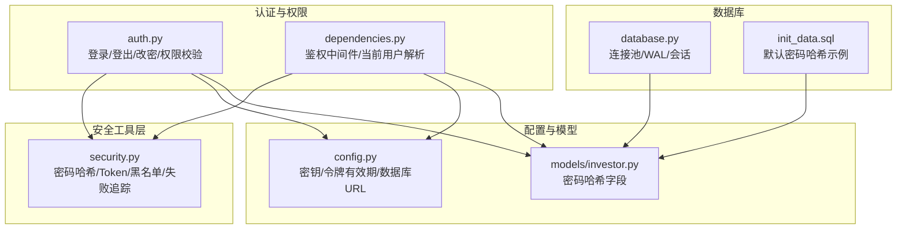
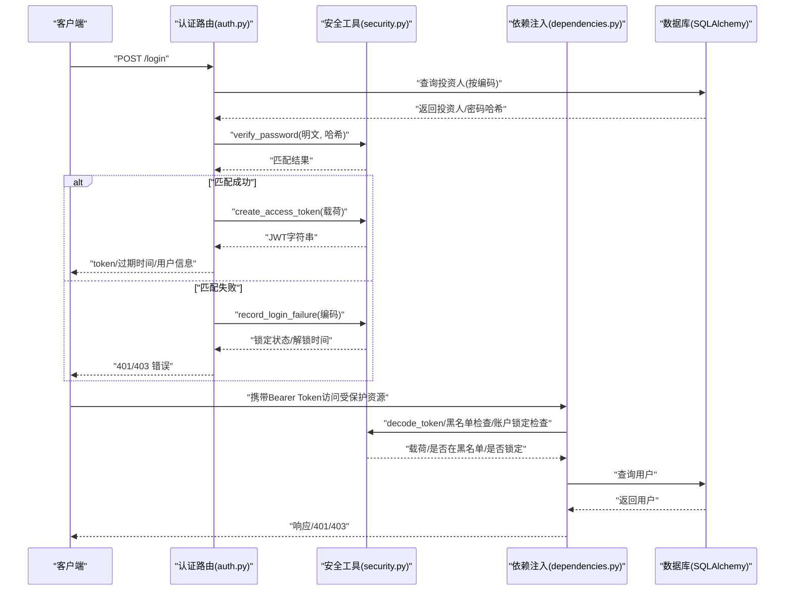
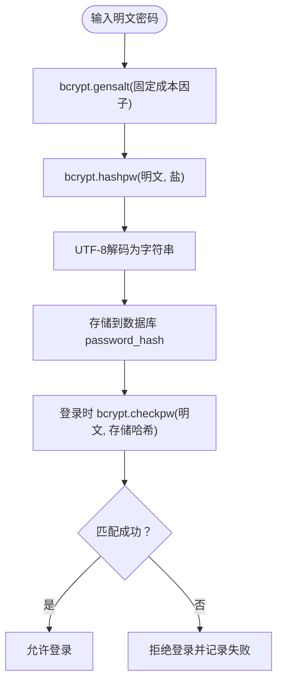
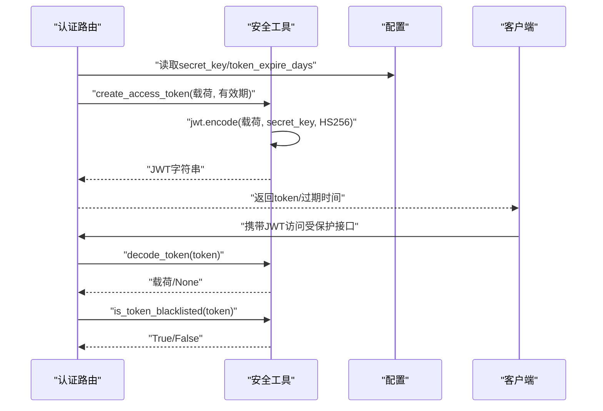
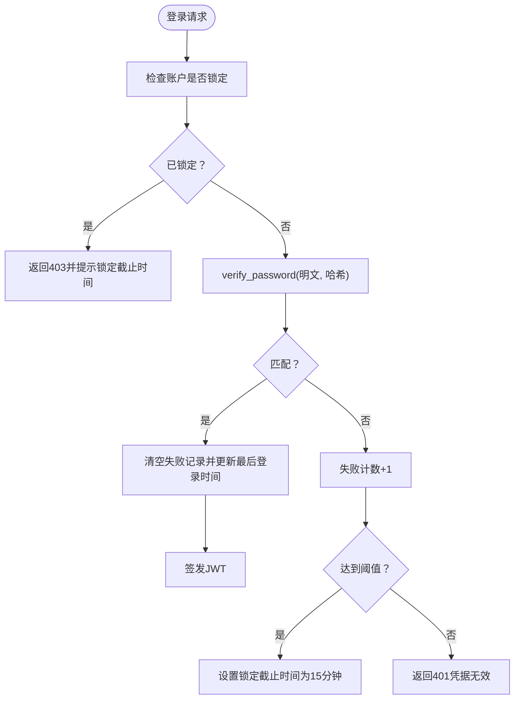
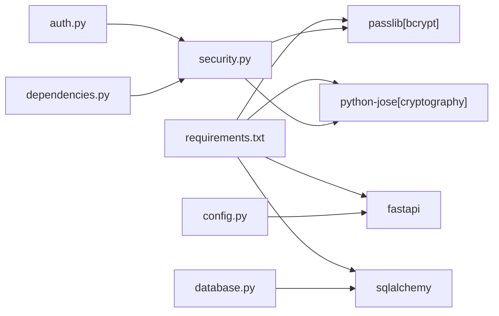

# 数据加密与安全存储

<cite>
**本文引用的文件**
- [backend/app/utils/security.py](file://backend/app/utils/security.py)
- [backend/app/routers/auth.py](file://backend/app/routers/auth.py)
- [backend/app/config.py](file://backend/app/config.py)
- [backend/app/models/investor.py](file://backend/app/models/investor.py)
- [backend/app/dependencies.py](file://backend/app/dependencies.py)
- [backend/app/database.py](file://backend/app/database.py)
- [backend/requirements.txt](file://backend/requirements.txt)
- [Docs/02-数据库设计.md](file://Docs/02-数据库设计.md)
- [Docs/init_data.sql](file://Docs/init_data.sql)
- [backend/migrate_db.py](file://backend/migrate_db.py)
- [Docs/05-前端开发.md](file://Docs/05-前端开发.md)
</cite>

## 目录
1. [简介](#简介)
2. [项目结构](#项目结构)
3. [核心组件](#核心组件)
4. [架构总览](#架构总览)
5. [详细组件分析](#详细组件分析)
6. [依赖分析](#依赖分析)
7. [性能考虑](#性能考虑)
8. [故障排查指南](#故障排查指南)
9. [结论](#结论)
10. [附录](#附录)

## 简介
本文件面向 InvestRing 的安全管理员与开发人员，系统化阐述数据加密与安全存储的设计与实现，重点覆盖以下方面：
- 密码哈希算法的选择与实现，包括 get_password_hash 的安全性考量与盐值生成机制
- 敏感数据的存储策略：密码哈希存储、Token 黑名单管理、会话安全
- 加密算法的性能与安全性评估、合规性要求
- 数据传输安全、存储加密与备份安全策略
- 加密密钥管理、安全轮换机制与数据泄露防护措施
- 面向管理员的实施方案与监控建议

## 项目结构
后端采用 FastAPI + SQLAlchemy 架构，安全相关能力集中在工具模块、认证路由、配置与依赖注入层：
- 安全工具：密码哈希、JWT 签发与解码、Token 黑名单、登录失败追踪
- 认证路由：登录、登出、改密流程，集成登录日志与权限校验
- 配置：密钥、令牌有效期、数据库连接参数
- 依赖：统一鉴权中间件、登录日志记录、当前用户解析
- 数据库：连接池、SQLite WAL 模式、模型定义（含密码哈希字段）

图表来源
- [backend/app/utils/security.py:1-103](file://backend/app/utils/security.py#L1-L103)
- [backend/app/routers/auth.py:1-186](file://backend/app/routers/auth.py#L1-L186)
- [backend/app/dependencies.py:1-146](file://backend/app/dependencies.py#L1-L146)
- [backend/app/config.py:1-37](file://backend/app/config.py#L1-L37)
- [backend/app/models/investor.py:1-17](file://backend/app/models/investor.py#L1-L17)
- [backend/app/database.py:1-39](file://backend/app/database.py#L1-L39)
- [Docs/init_data.sql:1-17](file://Docs/init_data.sql#L1-L17)

章节来源
- [backend/app/utils/security.py:1-103](file://backend/app/utils/security.py#L1-L103)
- [backend/app/routers/auth.py:1-186](file://backend/app/routers/auth.py#L1-L186)
- [backend/app/dependencies.py:1-146](file://backend/app/dependencies.py#L1-L146)
- [backend/app/config.py:1-37](file://backend/app/config.py#L1-L37)
- [backend/app/models/investor.py:1-17](file://backend/app/models/investor.py#L1-L17)
- [backend/app/database.py:1-39](file://backend/app/database.py#L1-L39)
- [Docs/init_data.sql:1-17](file://Docs/init_data.sql#L1-L17)

## 核心组件
- 密码哈希与校验：基于 bcrypt，使用固定成本因子与随机盐值，确保抗彩虹表与侧信道攻击
- JWT 令牌：HS256 签发与校验，结合黑名单与过期控制，实现会话撤销与时效管理
- 登录失败追踪与账户锁定：防暴力破解，降低凭证猜测风险
- 数据库存储：密码字段采用 bcrypt 哈希；SQLite 使用 WAL 模式提升并发性能
- 前端认证：本地存储 Token 与过期时间，路由守卫保障未登录访问控制

章节来源
- [backend/app/utils/security.py:15-26](file://backend/app/utils/security.py#L15-L26)
- [backend/app/utils/security.py:29-46](file://backend/app/utils/security.py#L29-L46)
- [backend/app/utils/security.py:57-102](file://backend/app/utils/security.py#L57-L102)
- [backend/app/models/investor.py:13](file://backend/app/models/investor.py#L13)
- [backend/app/database.py:18-26](file://backend/app/database.py#L18-L26)
- [Docs/05-前端开发.md:552-605](file://Docs/05-前端开发.md#L552-L605)

## 架构总览
下图展示登录与会话生命周期中的关键安全交互：

图表来源
- [backend/app/routers/auth.py:29-95](file://backend/app/routers/auth.py#L29-L95)
- [backend/app/utils/security.py:15-46](file://backend/app/utils/security.py#L15-L46)
- [backend/app/dependencies.py:49-111](file://backend/app/dependencies.py#L49-L111)

## 详细组件分析

### 密码哈希与盐值生成机制
- 算法选择：bcrypt，具备自适应成本因子，随硬件演进可提升成本，抵御 GPU/ASIC 破解
- 盐值生成：由 bcrypt.gensalt 生成，每次不同，确保相同明文生成不同哈希，抵御彩虹表
- 成本因子：工具模块中固定为 12，兼顾安全性与性能；数据库设计文档中默认初始化使用 cost 10
- 存储格式：哈希字符串存入数据库 password_hash 字段，长度上限 255

图表来源
- [backend/app/utils/security.py:22-26](file://backend/app/utils/security.py#L22-L26)
- [backend/app/utils/security.py:15-19](file://backend/app/utils/security.py#L15-L19)
- [backend/app/models/investor.py:13](file://backend/app/models/investor.py#L13)
- [Docs/init_data.sql:7-12](file://Docs/init_data.sql#L7-L12)

章节来源
- [backend/app/utils/security.py:15-26](file://backend/app/utils/security.py#L15-L26)
- [backend/app/models/investor.py:13](file://backend/app/models/investor.py#L13)
- [Docs/init_data.sql:7-12](file://Docs/init_data.sql#L7-L12)

### JWT 令牌签发与校验
- 签发：将子账号与角色放入载荷，设置过期时间，使用 HS256 算法与共享密钥签名
- 校验：解码时验证签名与过期时间，失败则判定无效
- 有效期：由配置项 token_expire_days 控制，默认 7 天
- 黑名单：登出或改密后将当前 Token 加入内存集合，后续请求被拒绝

图表来源
- [backend/app/utils/security.py:29-46](file://backend/app/utils/security.py#L29-L46)
- [backend/app/config.py:14-16](file://backend/app/config.py#L14-L16)
- [backend/app/routers/auth.py:98-119](file://backend/app/routers/auth.py#L98-L119)

章节来源
- [backend/app/utils/security.py:29-46](file://backend/app/utils/security.py#L29-L46)
- [backend/app/config.py:14-16](file://backend/app/config.py#L14-L16)
- [backend/app/routers/auth.py:98-119](file://backend/app/routers/auth.py#L98-L119)

### 登录失败追踪与账户锁定
- 失败计数：同一账户连续失败达到阈值（如 5 次），锁定 15 分钟
- 锁定状态：在内存字典中记录锁定截止时间，请求时检查并返回剩余锁定时间
- 清理机制：成功登录或锁定到期后清除记录

图表来源
- [backend/app/utils/security.py:57-102](file://backend/app/utils/security.py#L57-L102)
- [backend/app/routers/auth.py:29-95](file://backend/app/routers/auth.py#L29-L95)

章节来源
- [backend/app/utils/security.py:57-102](file://backend/app/utils/security.py#L57-L102)
- [backend/app/routers/auth.py:29-95](file://backend/app/routers/auth.py#L29-L95)

### 敏感数据存储策略
- 密码存储：仅存储 bcrypt 哈希，不保留明文；字段长度 255，满足 bcrypt 输出范围
- Token 黑名单：内存集合存储已撤销的 JWT，实现即时会话失效
- 登录日志：记录登录/登出/改密等关键动作及失败原因，便于审计与追踪
- 数据库并发：SQLite 使用 WAL 模式，提升读写并发性能，避免全局写锁

章节来源
- [backend/app/models/investor.py:13](file://backend/app/models/investor.py#L13)
- [backend/app/utils/security.py:10-12](file://backend/app/utils/security.py#L10-L12)
- [backend/app/dependencies.py:27-46](file://backend/app/dependencies.py#L27-L46)
- [backend/app/database.py:18-26](file://backend/app/database.py#L18-L26)

### 前端认证与会话安全
- Token 存储：localStorage 存放 token 与过期时间，路由守卫拦截未登录访问
- 过期检查：前端在请求前检查过期时间，避免发送无效令牌
- 权限控制：根据角色隐藏管理入口，后端同样进行角色校验

章节来源
- [Docs/05-前端开发.md:552-605](file://Docs/05-前端开发.md#L552-L605)

## 依赖分析
- 外部库依赖：FastAPI、SQLAlchemy、bcrypt、python-jose、Pydantic Settings 等
- 组件耦合：安全工具被认证路由与依赖注入共同使用，配置模块贯穿各层
- 潜在循环依赖：当前文件间无循环导入迹象

图表来源
- [backend/requirements.txt:1-18](file://backend/requirements.txt#L1-L18)
- [backend/app/utils/security.py:4-6](file://backend/app/utils/security.py#L4-L6)
- [backend/app/routers/auth.py:6-21](file://backend/app/routers/auth.py#L6-L21)
- [backend/app/dependencies.py:9](file://backend/app/dependencies.py#L9)

章节来源
- [backend/requirements.txt:1-18](file://backend/requirements.txt#L1-L18)
- [backend/app/utils/security.py:4-6](file://backend/app/utils/security.py#L4-L6)
- [backend/app/routers/auth.py:6-21](file://backend/app/routers/auth.py#L6-L21)
- [backend/app/dependencies.py:9](file://backend/app/dependencies.py#L9)

## 性能考虑
- bcrypt 成本因子：工具模块为 12，数据库初始化为 10；成本越高越抗暴力破解但计算开销越大
- JWT 解码：HS256 为对称算法，解码快速；黑名单检查为集合查找，复杂度 O(1)
- 数据库并发：SQLite WAL 模式显著提升读写并发，适合本项目“读多写少”的场景
- 连接池：SQLAlchemy 连接池参数合理，配合 pool_pre_ping 与 recycle 提升稳定性

章节来源
- [backend/app/utils/security.py:25](file://backend/app/utils/security.py#L25)
- [Docs/init_data.sql:7](file://Docs/init_data.sql#L7)
- [backend/app/database.py:8-16](file://backend/app/database.py#L8-L16)

## 故障排查指南
- 登录失败频繁被锁定
  - 检查登录失败追踪是否正确累加与到期清理
  - 确认当前时间与时区设置
- 令牌无效或过期
  - 核对 secret_key 是否一致，确认 token_expire_days 设置
  - 检查客户端是否正确存储与传递 token
- 登出后仍可访问
  - 确认登出接口是否调用了黑名单添加
  - 检查依赖注入中黑名单检查逻辑是否生效
- 数据库并发问题
  - 确认 SQLite WAL 模式已启用
  - 避免在高并发导入场景下同时执行定时任务

章节来源
- [backend/app/utils/security.py:57-102](file://backend/app/utils/security.py#L57-L102)
- [backend/app/routers/auth.py:98-119](file://backend/app/routers/auth.py#L98-L119)
- [backend/app/dependencies.py:67-73](file://backend/app/dependencies.py#L67-L73)
- [backend/app/database.py:18-26](file://backend/app/database.py#L18-L26)

## 结论
InvestRing 在密码存储、会话管理与数据库并发方面采用了成熟且平衡的安全实践：bcrypt 哈希、HS256 JWT、黑名单与失败追踪、SQLite WAL 模式。建议在生产环境中进一步完善密钥轮换、传输加密与备份加密策略，以满足更严格的合规要求。

## 附录

### 数据传输安全
- 建议在生产环境强制 HTTPS，避免明文传输 Token 与敏感数据
- 前端路由守卫与 Cookie 策略需配合安全头（如 SameSite、HttpOnly）使用

章节来源
- [Docs/05-前端开发.md:552-605](file://Docs/05-前端开发.md#L552-L605)

### 存储加密与备份安全
- 当前密码以 bcrypt 哈希存储，符合最小暴露原则
- 建议对数据库备份文件进行加密存储与传输，定期轮换备份密钥
- 备份恢复流程需验证数据一致性与哈希完整性

章节来源
- [backend/migrate_db.py:10-39](file://backend/migrate_db.py#L10-L39)

### 加密密钥管理与轮换
- 密钥来源：配置模块的 secret_key，需在部署时替换为强随机值
- 轮换策略：采用双密钥过渡期，先用新密钥签发，旧密钥解码，随后切换为单新密钥
- 存储与权限：密钥仅存放于受控环境变量，最小权限访问

章节来源
- [backend/app/config.py:14-16](file://backend/app/config.py#L14-L16)
- [backend/app/utils/security.py:37](file://backend/app/utils/security.py#L37)

### 合规性与最佳实践
- 密码策略：强制复杂度、定期轮换、禁止明文存储
- 日志审计：记录关键安全事件（登录、登出、改密、失败），保留足够时间窗口
- 最小权限：前端与后端均实施角色控制，避免越权访问

章节来源
- [backend/app/dependencies.py:114-129](file://backend/app/dependencies.py#L114-L129)
- [backend/app/dependencies.py:27-46](file://backend/app/dependencies.py#L27-L46)