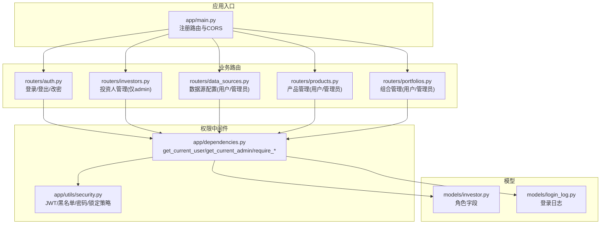
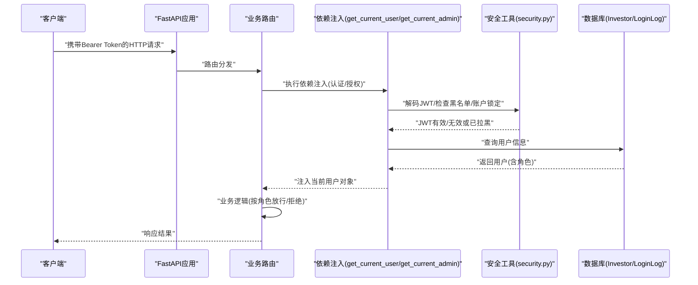
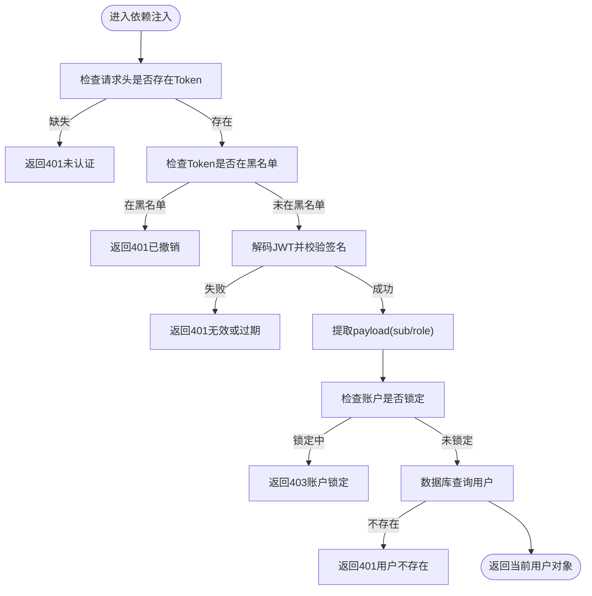
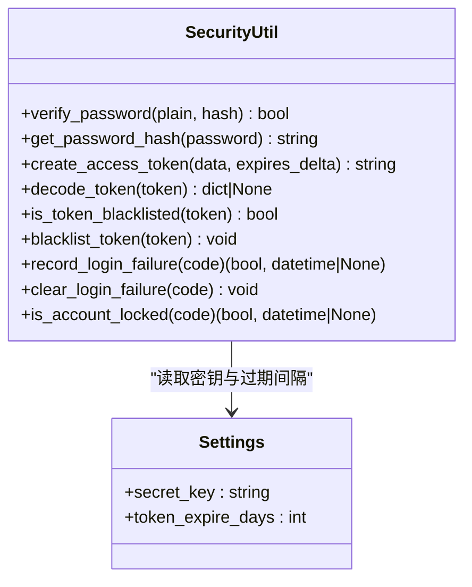
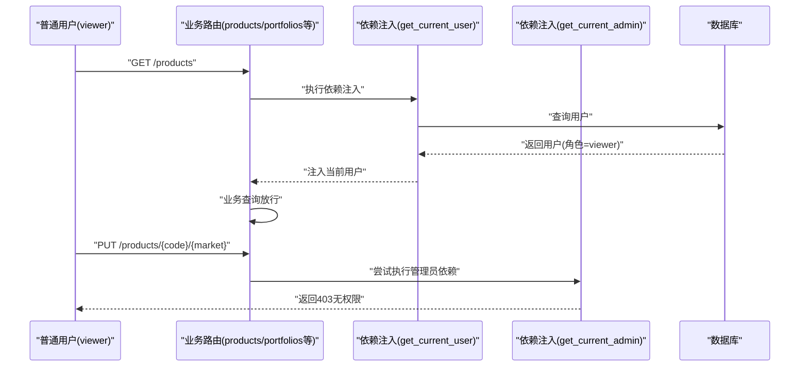
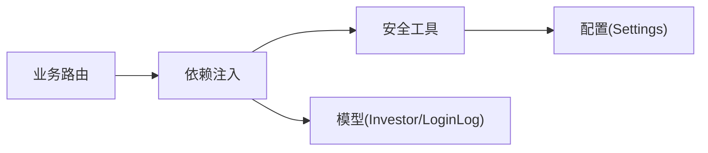

# 权限控制系统

<cite>
**本文引用的文件**
- [backend/app/dependencies.py](file://backend/app/dependencies.py)
- [backend/app/utils/security.py](file://backend/app/utils/security.py)
- [backend/app/models/investor.py](file://backend/app/models/investor.py)
- [backend/app/models/login_log.py](file://backend/app/models/login_log.py)
- [backend/app/routers/auth.py](file://backend/app/routers/auth.py)
- [backend/app/routers/investors.py](file://backend/app/routers/investors.py)
- [backend/app/routers/data_sources.py](file://backend/app/routers/data_sources.py)
- [backend/app/routers/products.py](file://backend/app/routers/products.py)
- [backend/app/routers/portfolios.py](file://backend/app/routers/portfolios.py)
- [backend/app/config.py](file://backend/app/config.py)
- [backend/app/main.py](file://backend/app/main.py)
</cite>

## 目录
1. [简介](#简介)
2. [项目结构](#项目结构)
3. [核心组件](#核心组件)
4. [架构总览](#架构总览)
5. [详细组件分析](#详细组件分析)
6. [依赖分析](#依赖分析)
7. [性能考虑](#性能考虑)
8. [故障排查指南](#故障排查指南)
9. [结论](#结论)
10. [附录](#附录)

## 简介
本文件系统性阐述 InvestRing 的权限控制系统，围绕基于角色的访问控制（RBAC）展开，重点覆盖以下内容：
- 角色模型与权限差异：admin 与 viewer 两种角色的职责边界与权限范围
- 权限检查中间件：get_current_user、get_current_admin 与权限装饰器 require_auth、require_admin 的实现机制
- 路由级权限要求：普通用户仅可访问自身相关数据，管理员可访问全量数据
- 权限验证流程、权限提升机制与安全边界
- 权限矩阵图、常见问题与最佳实践

## 项目结构
权限控制相关代码主要分布在以下模块：
- 中间件与依赖：backend/app/dependencies.py 提供认证与授权依赖注入
- 安全工具：backend/app/utils/security.py 提供密码哈希、JWT 编解码、令牌黑名单与账户锁定策略
- 模型定义：backend/app/models/investor.py 定义用户角色字段；backend/app/models/login_log.py 记录登录与操作日志
- 路由层：各业务路由根据需要引入 get_current_user 或 get_current_admin，实现细粒度权限控制
- 应用入口：backend/app/main.py 注册所有路由并挂载 CORS

图表来源
- [backend/app/main.py:32-48](file://backend/app/main.py#L32-L48)
- [backend/app/dependencies.py:49-145](file://backend/app/dependencies.py#L49-L145)
- [backend/app/utils/security.py:15-103](file://backend/app/utils/security.py#L15-L103)
- [backend/app/models/investor.py:5-16](file://backend/app/models/investor.py#L5-L16)
- [backend/app/models/login_log.py:5-15](file://backend/app/models/login_log.py#L5-L15)
- [backend/app/routers/auth.py:29-186](file://backend/app/routers/auth.py#L29-L186)
- [backend/app/routers/investors.py:14-120](file://backend/app/routers/investors.py#L14-L120)
- [backend/app/routers/data_sources.py:63-150](file://backend/app/routers/data_sources.py#L63-L150)
- [backend/app/routers/products.py:27-142](file://backend/app/routers/products.py#L27-L142)
- [backend/app/routers/portfolios.py:18-200](file://backend/app/routers/portfolios.py#L18-L200)

章节来源
- [backend/app/main.py:17-53](file://backend/app/main.py#L17-L53)

## 核心组件
- 用户模型与角色
  - 用户模型包含角色字段，默认为 viewer，admin 为管理员角色
- 权限中间件
  - get_current_user：解析并验证 JWT，检查黑名单与账户锁定状态，返回当前用户对象
  - get_current_admin：在 get_current_user 基础上进一步校验角色是否为 admin
  - require_auth / require_admin：装饰器形式的依赖注入，用于路由声明式权限
- 安全工具
  - 密码哈希与校验、JWT 签发与解码、令牌黑名单、登录失败计数与账户锁定策略
- 登录日志模型
  - 记录登录、登出、改密等关键动作及失败原因，便于审计与追踪

章节来源
- [backend/app/models/investor.py:5-16](file://backend/app/models/investor.py#L5-L16)
- [backend/app/dependencies.py:49-145](file://backend/app/dependencies.py#L49-L145)
- [backend/app/utils/security.py:15-103](file://backend/app/utils/security.py#L15-L103)
- [backend/app/models/login_log.py:5-15](file://backend/app/models/login_log.py#L5-L15)

## 架构总览
下图展示权限控制在请求生命周期中的作用点与交互关系。

图表来源
- [backend/app/dependencies.py:49-145](file://backend/app/dependencies.py#L49-L145)
- [backend/app/utils/security.py:29-47](file://backend/app/utils/security.py#L29-L47)
- [backend/app/models/investor.py:5-16](file://backend/app/models/investor.py#L5-L16)
- [backend/app/models/login_log.py:5-15](file://backend/app/models/login_log.py#L5-L15)

## 详细组件分析

### 权限中间件与装饰器
- get_current_user
  - 必要条件：请求头携带合法 Bearer Token
  - 校验步骤：黑名单检查、JWT 解码、payload 校验、账户锁定状态、数据库查询用户
  - 返回：当前用户对象（包含角色）
- get_current_admin
  - 在 get_current_user 成功后，进一步校验角色是否为 admin
  - 非 admin 将直接返回 403
- require_auth / require_admin
  - 以 Depends 形式在路由层声明式启用认证或管理员权限

图表来源
- [backend/app/dependencies.py:49-111](file://backend/app/dependencies.py#L49-L111)
- [backend/app/utils/security.py:41-47](file://backend/app/utils/security.py#L41-L47)

章节来源
- [backend/app/dependencies.py:49-145](file://backend/app/dependencies.py#L49-L145)

### 安全工具与令牌管理
- JWT 签发与解码
  - 使用 HS256 算法，secret_key 由配置提供
- 令牌黑名单
  - 登出时将当前 Token 加入黑名单，后续同 Token 请求将被拒绝
- 密码安全
  - 使用 bcrypt 进行哈希与校验
- 账户锁定策略
  - 连续登录失败达到阈值后临时锁定，超时自动解锁

图表来源
- [backend/app/utils/security.py:15-103](file://backend/app/utils/security.py#L15-L103)
- [backend/app/config.py:5-37](file://backend/app/config.py#L5-L37)

章节来源
- [backend/app/utils/security.py:15-103](file://backend/app/utils/security.py#L15-L103)
- [backend/app/config.py:5-37](file://backend/app/config.py#L5-L37)

### 路由级权限要求与行为
- 认证与改密
  - 登录：成功后签发包含用户角色的 JWT
  - 登出：将当前 Token 黑名单化
  - 修改密码：admin 可改任意用户；viewer 仅能改自己并需旧密码校验
- 投资人管理
  - 所有接口均需管理员权限
- 数据源配置
  - 查询：普通用户即可访问
  - 更新：仅管理员可更新
- 产品管理
  - 查询：普通用户可访问
  - 新增/更新/删除：仅管理员
- 组合管理
  - 查询：普通用户可访问
  - 新增/更新：仅管理员
  - 关闭/重开：仅管理员

图表来源
- [backend/app/routers/products.py:27-142](file://backend/app/routers/products.py#L27-L142)
- [backend/app/routers/portfolios.py:18-200](file://backend/app/routers/portfolios.py#L18-L200)
- [backend/app/dependencies.py:114-129](file://backend/app/dependencies.py#L114-L129)

章节来源
- [backend/app/routers/auth.py:29-186](file://backend/app/routers/auth.py#L29-L186)
- [backend/app/routers/investors.py:14-120](file://backend/app/routers/investors.py#L14-L120)
- [backend/app/routers/data_sources.py:63-150](file://backend/app/routers/data_sources.py#L63-L150)
- [backend/app/routers/products.py:27-142](file://backend/app/routers/products.py#L27-L142)
- [backend/app/routers/portfolios.py:18-200](file://backend/app/routers/portfolios.py#L18-L200)

### 权限矩阵图
下表总结了各路由对权限的要求（viewer/admin）：

- 认证与改密
  - 登录：匿名可访问
  - 登出：需认证
  - 修改密码：viewer(仅限自身且需旧密码) / admin(任意用户)
- 投资人管理
  - 列表/新增/详情/更新/删除：仅 admin
- 数据源配置
  - 列表：viewer
  - 更新：admin
- 产品管理
  - 列表/详情：viewer
  - 新增/更新/删除：admin
- 组合管理
  - 列表/详情/净值曲线/收益：viewer
  - 新增/更新/关闭/重开：admin

章节来源
- [backend/app/routers/auth.py:29-186](file://backend/app/routers/auth.py#L29-L186)
- [backend/app/routers/investors.py:14-120](file://backend/app/routers/investors.py#L14-L120)
- [backend/app/routers/data_sources.py:63-150](file://backend/app/routers/data_sources.py#L63-L150)
- [backend/app/routers/products.py:27-142](file://backend/app/routers/products.py#L27-L142)
- [backend/app/routers/portfolios.py:18-200](file://backend/app/routers/portfolios.py#L18-L200)

### 权限验证流程与安全边界
- 流程要点
  - 令牌必达：无 Token 直接 401
  - 令牌有效：黑名单/过期/签名错误统一 401
  - 用户存在：用户不存在 401
  - 账户状态：锁定中 403
  - 角色校验：admin 路由仅 admin 可访问
- 安全边界
  - 登出即失效：登出将当前 Token 黑名单化
  - 强制改密后登出：修改密码后当前 Token 黑名单化，需重新登录
  - 日志审计：登录、登出、改密均记录日志，含失败原因

章节来源
- [backend/app/dependencies.py:49-145](file://backend/app/dependencies.py#L49-L145)
- [backend/app/utils/security.py:49-55](file://backend/app/utils/security.py#L49-L55)
- [backend/app/routers/auth.py:98-186](file://backend/app/routers/auth.py#L98-L186)
- [backend/app/models/login_log.py:5-15](file://backend/app/models/login_log.py#L5-L15)

## 依赖分析
- 组件耦合
  - 路由层仅依赖依赖注入模块，不直接操作数据库或安全细节，保持高内聚低耦合
  - 依赖注入模块依赖安全工具与数据库会话，形成清晰的控制反转
- 外部依赖
  - JWT 解析依赖 jose
  - 密码哈希依赖 bcrypt
  - 配置依赖 pydantic-settings
- 循环依赖
  - 未发现循环导入；依赖方向自上而下（路由 → 依赖 → 工具）

图表来源
- [backend/app/routers/auth.py:15-21](file://backend/app/routers/auth.py#L15-L21)
- [backend/app/dependencies.py:1-11](file://backend/app/dependencies.py#L1-L11)
- [backend/app/utils/security.py:1-8](file://backend/app/utils/security.py#L1-L8)
- [backend/app/config.py:5-37](file://backend/app/config.py#L5-L37)

章节来源
- [backend/app/routers/auth.py:15-21](file://backend/app/routers/auth.py#L15-L21)
- [backend/app/dependencies.py:1-11](file://backend/app/dependencies.py#L1-L11)
- [backend/app/utils/security.py:1-8](file://backend/app/utils/security.py#L1-L8)
- [backend/app/config.py:5-37](file://backend/app/config.py#L5-L37)

## 性能考虑
- 依赖注入的数据库查询应避免 N+1 问题，优先批量查询与连接复用
- JWT 解码与黑名单检查为常量时间操作，整体开销极低
- 密码哈希成本较高，建议在必要场景（如登录、改密）使用，避免在高频路径重复计算
- 登录失败计数与锁定策略使用内存字典，重启后丢失；生产环境建议持久化

## 故障排查指南
- 401 未认证
  - 检查请求头是否携带 Bearer Token
  - 检查 Token 是否在黑名单（登出后即失效）
  - 检查 Token 是否过期或签名无效
- 403 禁止访问
  - 确认当前用户角色是否满足路由要求
  - 管理员路由仅 admin 可访问
- 账户被锁定
  - 查看登录失败计数与锁定截止时间
  - 等待锁定时间结束后重试
- 修改密码失败
  - viewer 修改他人密码会被拒绝
  - viewer 修改自身密码需提供旧密码
  - 修改密码后需重新登录

章节来源
- [backend/app/dependencies.py:49-145](file://backend/app/dependencies.py#L49-L145)
- [backend/app/utils/security.py:57-103](file://backend/app/utils/security.py#L57-L103)
- [backend/app/routers/auth.py:122-186](file://backend/app/routers/auth.py#L122-L186)

## 结论
InvestRing 的权限体系以 RBAC 为核心，通过中间件与装饰器在路由层实现细粒度控制。普通用户仅能访问自身相关数据，管理员拥有系统级操作权限。配合 JWT、黑名单、账户锁定与登录日志，形成了完整的安全边界与审计能力。建议在生产环境中将登录失败计数与锁定状态持久化，并对高频路径进行缓存优化。

## 附录
- 开发者最佳实践
  - 在每个路由明确声明所需权限（require_auth / require_admin）
  - 对敏感操作（新增/更新/删除）一律使用管理员权限
  - 修改密码后主动将当前 Token 黑名单化，确保权限即时生效
  - 使用统一的日志记录模块记录关键操作与失败原因
  - 生产环境务必设置强密钥与合理过期时间