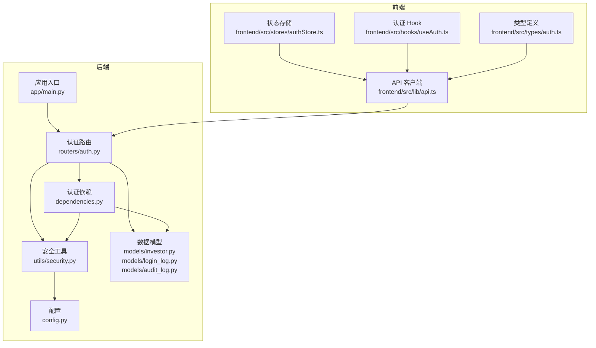
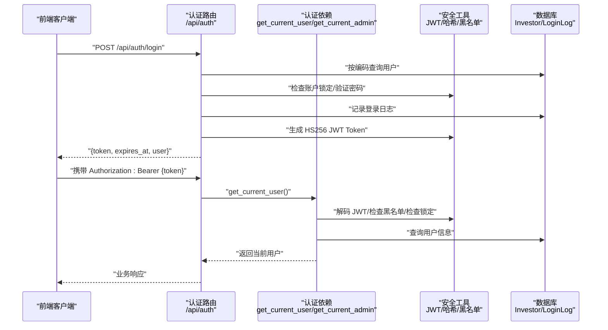
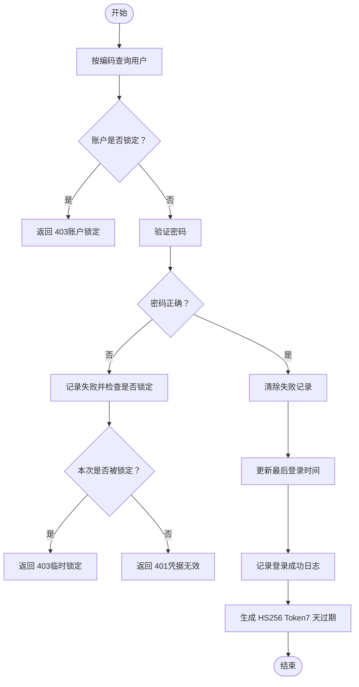
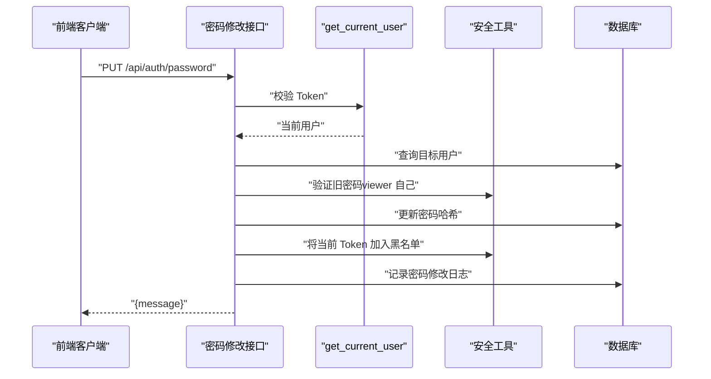
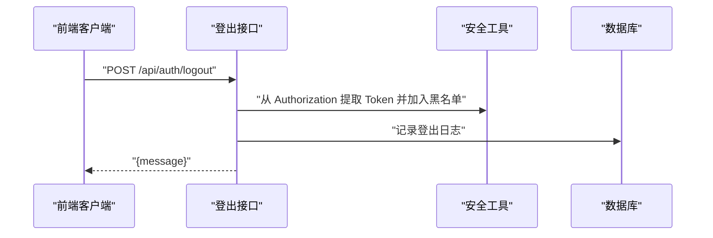
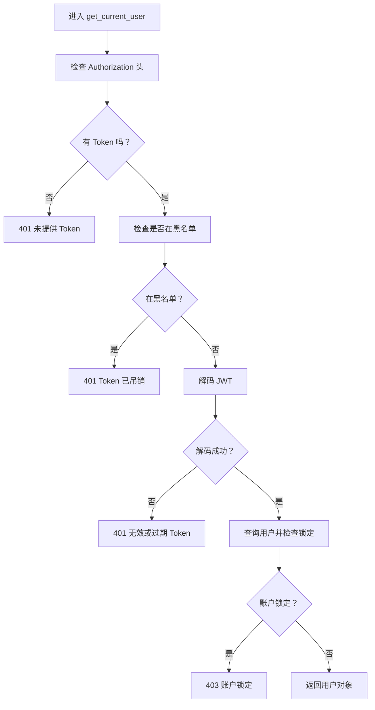
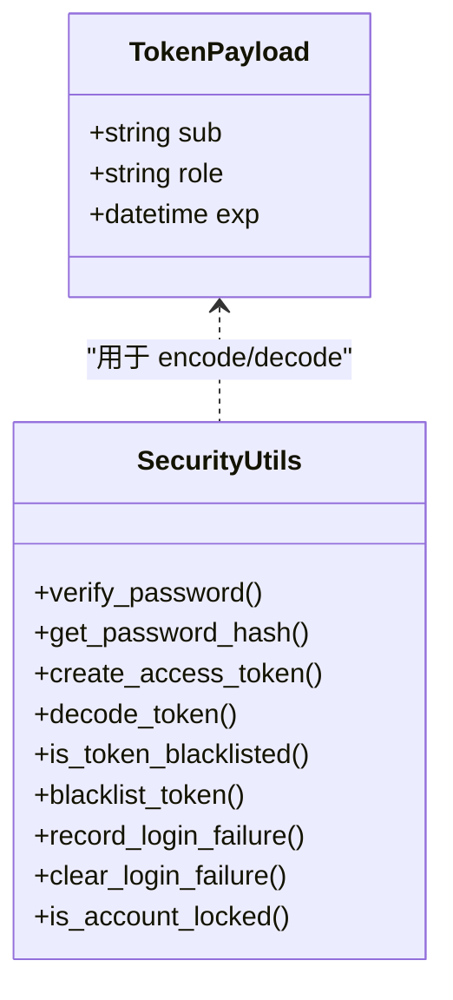
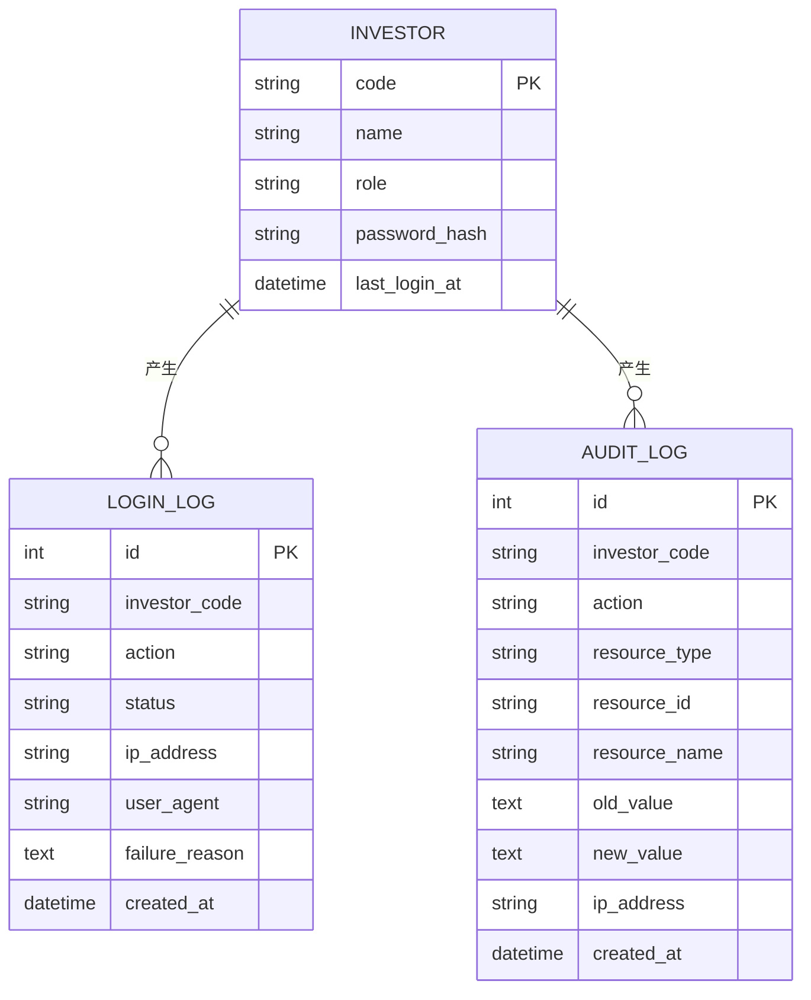
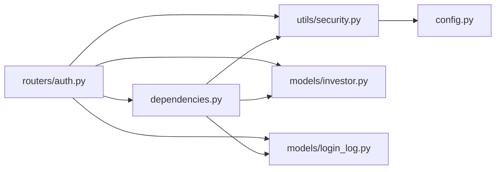

# 用户认证机制

<cite>
**本文引用的文件**
- [backend/app/routers/auth.py](file://backend/app/routers/auth.py)
- [backend/app/schemas/auth.py](file://backend/app/schemas/auth.py)
- [backend/app/utils/security.py](file://backend/app/utils/security.py)
- [backend/app/models/login_log.py](file://backend/app/models/login_log.py)
- [backend/app/models/audit_log.py](file://backend/app/models/audit_log.py)
- [backend/app/models/investor.py](file://backend/app/models/investor.py)
- [backend/app/dependencies.py](file://backend/app/dependencies.py)
- [backend/app/config.py](file://backend/app/config.py)
- [backend/app/main.py](file://backend/app/main.py)
- [frontend/src/lib/api.ts](file://frontend/src/lib/api.ts)
- [frontend/src/stores/authStore.ts](file://frontend/src/stores/authStore.ts)
- [frontend/src/hooks/useAuth.ts](file://frontend/src/hooks/useAuth.ts)
- [frontend/src/types/auth.ts](file://frontend/src/types/auth.ts)
- [Docs/04-后端开发.md](file://Docs/04-后端开发.md)
</cite>

## 目录
1. [简介](#简介)
2. [项目结构](#项目结构)
3. [核心组件](#核心组件)
4. [架构总览](#架构总览)
5. [详细组件分析](#详细组件分析)
6. [依赖关系分析](#依赖关系分析)
7. [性能考量](#性能考量)
8. [故障排查指南](#故障排查指南)
9. [结论](#结论)
10. [附录](#附录)

## 简介
本文件系统性地文档化 InvestRing 的用户认证机制，覆盖登录验证、密码哈希、基于 HMAC 的 Token 生成与验证、登录失败锁定、IP 与 User-Agent 追踪、安全日志记录、认证中间件（依赖注入）工作原理，以及前后端交互流程与错误处理策略。文档同时提供认证流程图、安全令牌结构与过期处理机制说明，并给出开发者集成指南。

## 项目结构
认证相关代码主要分布在后端的路由、依赖、工具与模型层，以及前端的 API 客户端与状态存储；后端通过 FastAPI 路由暴露认证接口，使用依赖注入实现鉴权中间件，利用内存级黑名单与失败计数实现简单但有效的安全控制。

图表来源
- [backend/app/main.py:33](file://backend/app/main.py#L33)
- [backend/app/routers/auth.py:29](file://backend/app/routers/auth.py#L29)
- [backend/app/dependencies.py:49](file://backend/app/dependencies.py#L49)
- [backend/app/utils/security.py:29](file://backend/app/utils/security.py#L29)
- [backend/app/models/investor.py:5](file://backend/app/models/investor.py#L5)
- [backend/app/models/login_log.py:5](file://backend/app/models/login_log.py#L5)
- [backend/app/models/audit_log.py:5](file://backend/app/models/audit_log.py#L5)
- [backend/app/config.py:5](file://backend/app/config.py#L5)
- [frontend/src/lib/api.ts:50](file://frontend/src/lib/api.ts#L50)
- [frontend/src/stores/authStore.ts:29](file://frontend/src/stores/authStore.ts#L29)
- [frontend/src/hooks/useAuth.ts:12](file://frontend/src/hooks/useAuth.ts#L12)
- [frontend/src/types/auth.ts:1](file://frontend/src/types/auth.ts#L1)

章节来源
- [backend/app/main.py:33](file://backend/app/main.py#L33)
- [backend/app/routers/auth.py:29](file://backend/app/routers/auth.py#L29)
- [frontend/src/lib/api.ts:50](file://frontend/src/lib/api.ts#L50)

## 核心组件
- 登录接口：接收用户编码与密码，进行账户锁定检查、密码验证、失败计数与锁定、成功后生成 Token 并记录日志。
- 密码修改接口：支持管理员修改他人密码与普通用户修改自己的密码（需旧密码），修改后使当前 Token 失效并记录日志。
- 登出接口：从请求头解析 Bearer Token 并加入黑名单，记录登出日志。
- 认证中间件：get_current_user 与 get_current_admin 依赖函数，负责 Token 解析、黑名单检查、账户锁定检查与用户查询。
- 安全工具：bcrypt 密码哈希、HS256 JWT 编解码、Token 黑名单、登录失败追踪与锁定逻辑。
- 数据模型：Investor、LoginLog、AuditLog。
- 前端集成：Axios 请求拦截器自动附加 Bearer Token，401 统一跳转登录，状态持久化与认证守卫。

章节来源
- [backend/app/routers/auth.py:29](file://backend/app/routers/auth.py#L29)
- [backend/app/routers/auth.py:122](file://backend/app/routers/auth.py#L122)
- [backend/app/routers/auth.py:98](file://backend/app/routers/auth.py#L98)
- [backend/app/dependencies.py:49](file://backend/app/dependencies.py#L49)
- [backend/app/utils/security.py:15](file://backend/app/utils/security.py#L15)
- [backend/app/models/investor.py:5](file://backend/app/models/investor.py#L5)
- [backend/app/models/login_log.py:5](file://backend/app/models/login_log.py#L5)
- [frontend/src/lib/api.ts:50](file://frontend/src/lib/api.ts#L50)

## 架构总览
下图展示认证端到端流程：前端发起登录请求，后端验证、记录日志、签发 Token；后续请求由前端携带 Token，后端中间件完成鉴权与授权。

图表来源
- [backend/app/routers/auth.py:29](file://backend/app/routers/auth.py#L29)
- [backend/app/dependencies.py:49](file://backend/app/dependencies.py#L49)
- [backend/app/utils/security.py:29](file://backend/app/utils/security.py#L29)
- [backend/app/models/investor.py:5](file://backend/app/models/investor.py#L5)
- [backend/app/models/login_log.py:5](file://backend/app/models/login_log.py#L5)
- [frontend/src/lib/api.ts:50](file://frontend/src/lib/api.ts#L50)

## 详细组件分析

### 登录流程与错误处理
- 账户锁定检查：若账户处于锁定期内，直接返回禁止访问并包含锁定截止时间。
- 密码验证：用户不存在或密码不匹配则记录失败、可能触发锁定（连续 5 次失败锁定 15 分钟）。
- 成功登录：清除失败记录、更新最后登录时间、记录登录日志，生成 Token（默认 7 天过期）。
- 响应结构：包含 token、expires_at（ISO 时间字符串）、user（code、name、role）。

图表来源
- [backend/app/routers/auth.py:34](file://backend/app/routers/auth.py#L34)
- [backend/app/routers/auth.py:50](file://backend/app/routers/auth.py#L50)
- [backend/app/utils/security.py:57](file://backend/app/utils/security.py#L57)
- [backend/app/utils/security.py:89](file://backend/app/utils/security.py#L89)

章节来源
- [backend/app/routers/auth.py:29](file://backend/app/routers/auth.py#L29)
- [backend/app/routers/auth.py:34](file://backend/app/routers/auth.py#L34)
- [backend/app/routers/auth.py:50](file://backend/app/routers/auth.py#L50)
- [backend/app/utils/security.py:57](file://backend/app/utils/security.py#L57)
- [backend/app/utils/security.py:89](file://backend/app/utils/security.py#L89)

### 密码修改与强制重新登录
- 权限规则：admin 可修改任意用户密码；viewer 仅能修改自己的密码且需提供旧密码。
- 修改后：立即使当前 Token 失效（加入黑名单），并记录日志，提示用户重新登录。

图表来源
- [backend/app/routers/auth.py:122](file://backend/app/routers/auth.py#L122)
- [backend/app/dependencies.py:49](file://backend/app/dependencies.py#L49)
- [backend/app/utils/security.py:53](file://backend/app/utils/security.py#L53)

章节来源
- [backend/app/routers/auth.py:122](file://backend/app/routers/auth.py#L122)
- [backend/app/routers/auth.py:153](file://backend/app/routers/auth.py#L153)
- [backend/app/routers/auth.py:175](file://backend/app/routers/auth.py#L175)

### 登出与 Token 黑名单
- 登出接口：从 Authorization 头提取 Bearer Token，将其加入黑名单，记录登出日志。
- 中间件：get_current_user 在每次受保护请求中检查 Token 是否在黑名单内，若在则拒绝。

图表来源
- [backend/app/routers/auth.py:98](file://backend/app/routers/auth.py#L98)
- [backend/app/utils/security.py:53](file://backend/app/utils/security.py#L53)
- [backend/app/dependencies.py:67](file://backend/app/dependencies.py#L67)

章节来源
- [backend/app/routers/auth.py:98](file://backend/app/routers/auth.py#L98)
- [backend/app/utils/security.py:53](file://backend/app/utils/security.py#L53)
- [backend/app/dependencies.py:67](file://backend/app/dependencies.py#L67)

### 认证中间件：get_current_user 与 get_current_admin
- get_current_user
  - 必须提供 Bearer Token，否则 401。
  - 检查 Token 是否在黑名单，若是则 401。
  - 解码 JWT，若失败或过期则 401。
  - 校验 sub 字段，查询用户，检查账户是否锁定，最终返回用户对象。
- get_current_admin
  - 在 get_current_user 基础上进一步校验用户角色必须为 admin，否则 403。

图表来源
- [backend/app/dependencies.py:49](file://backend/app/dependencies.py#L49)
- [backend/app/utils/security.py:41](file://backend/app/utils/security.py#L41)
- [backend/app/utils/security.py:89](file://backend/app/utils/security.py#L89)

章节来源
- [backend/app/dependencies.py:49](file://backend/app/dependencies.py#L49)
- [backend/app/dependencies.py:114](file://backend/app/dependencies.py#L114)

### 安全令牌结构与过期处理
- 算法：HS256（HMAC + SHA-256）。
- 载荷字段：sub（用户编码）、role（用户角色）、exp（过期时间）。
- 过期策略：默认 7 天；服务端在签发时根据配置设置 exp。
- 存储与传输：前端通过本地存储与 Cookie 持久化，Axios 请求拦截器自动附加 Authorization 头。

图表来源
- [backend/app/utils/security.py:29](file://backend/app/utils/security.py#L29)
- [backend/app/utils/security.py:41](file://backend/app/utils/security.py#L41)
- [backend/app/config.py:15](file://backend/app/config.py#L15)

章节来源
- [backend/app/utils/security.py:29](file://backend/app/utils/security.py#L29)
- [backend/app/utils/security.py:41](file://backend/app/utils/security.py#L41)
- [backend/app/config.py:15](file://backend/app/config.py#L15)

### 登录失败锁定机制、IP 与 User-Agent 追踪、安全日志
- 登录失败锁定
  - 失败计数：同一账户连续 5 次失败后锁定 15 分钟。
  - 锁定状态：在内存字典中维护每个账户的失败次数与锁定截止时间。
- IP 与 User-Agent
  - 从请求头提取 X-Forwarded-For 或客户端地址，以及 User-Agent。
- 安全日志
  - 登录成功/失败均写入 login_log 表，包含 investor_code、action、status、ip_address、user_agent、failure_reason。
  - 密码修改与审计日志分别记录在 audit_log 表中（用于审计场景）。

图表来源
- [backend/app/models/investor.py:5](file://backend/app/models/investor.py#L5)
- [backend/app/models/login_log.py:5](file://backend/app/models/login_log.py#L5)
- [backend/app/models/audit_log.py:5](file://backend/app/models/audit_log.py#L5)

章节来源
- [backend/app/utils/security.py:57](file://backend/app/utils/security.py#L57)
- [backend/app/utils/security.py:89](file://backend/app/utils/security.py#L89)
- [backend/app/dependencies.py:14](file://backend/app/dependencies.py#L14)
- [backend/app/dependencies.py:22](file://backend/app/dependencies.py#L22)
- [backend/app/dependencies.py:27](file://backend/app/dependencies.py#L27)
- [backend/app/models/login_log.py:5](file://backend/app/models/login_log.py#L5)
- [backend/app/models/audit_log.py:5](file://backend/app/models/audit_log.py#L5)

### 前端集成与最佳实践
- 请求拦截器：自动从本地存储读取 token 并附加到 Authorization 头。
- 响应拦截器：捕获 401 统一清理本地 token 并跳转登录页。
- 状态管理：使用持久化存储保存 token 与用户信息，支持跨页面会话。
- 认证守卫：在路由层使用 useAuthGuard 控制访问，避免未登录用户进入受保护页面。
- 最佳实践
  - 生产环境务必设置安全的 secret_key 与 HTTPS。
  - 建议启用 CSRF 保护与 SameSite Cookie 策略。
  - 定期轮换密钥并监控登录日志与审计日志。

章节来源
- [frontend/src/lib/api.ts:50](file://frontend/src/lib/api.ts#L50)
- [frontend/src/lib/api.ts:67](file://frontend/src/lib/api.ts#L67)
- [frontend/src/stores/authStore.ts:29](file://frontend/src/stores/authStore.ts#L29)
- [frontend/src/hooks/useAuth.ts:97](file://frontend/src/hooks/useAuth.ts#L97)

## 依赖关系分析
- 路由依赖于依赖注入与安全工具：登录、登出、改密均调用 get_client_ip、get_user_agent、record_login_log、verify_password、get_password_hash、create_access_token、blacklist_token、is_account_locked 等。
- 中间件依赖于安全工具与数据库：get_current_user 与 get_current_admin 依赖 decode_token、is_token_blacklisted、is_account_locked 与数据库查询。
- 配置依赖于 Settings：secret_key 与 token_expire_days 影响 JWT 签发与过期策略。

图表来源
- [backend/app/routers/auth.py:15](file://backend/app/routers/auth.py#L15)
- [backend/app/dependencies.py:9](file://backend/app/dependencies.py#L9)
- [backend/app/utils/security.py:8](file://backend/app/utils/security.py#L8)
- [backend/app/config.py:5](file://backend/app/config.py#L5)

章节来源
- [backend/app/routers/auth.py:15](file://backend/app/routers/auth.py#L15)
- [backend/app/dependencies.py:9](file://backend/app/dependencies.py#L9)
- [backend/app/utils/security.py:8](file://backend/app/utils/security.py#L8)
- [backend/app/config.py:5](file://backend/app/config.py#L5)

## 性能考量
- 内存级缓存与计数：登录失败追踪与 Token 黑名单采用内存结构，适合单实例部署；多实例需引入共享缓存（如 Redis）以保证一致性。
- 密码哈希成本：bcrypt 默认迭代轮数较高，验证开销可控；若并发量大可评估轮数与硬件资源平衡。
- JWT 解码：HS256 解码轻量，CPU 开销低；建议避免在高频路径重复解码，可结合缓存与最小化依赖注入层级。
- 数据库写入：登录日志与审计日志写入数据库，建议异步队列或批量写入降低阻塞。

## 故障排查指南
- 401 未提供 Token
  - 检查前端是否正确附加 Authorization 头；确认本地存储中存在 token。
- 401 无效或过期 Token
  - 检查服务端 secret_key 是否一致；确认 token 未被加入黑名单；核对系统时间与时区。
- 403 账户锁定
  - 查看登录失败计数与锁定截止时间；等待锁定期结束后重试。
- 401 用户不存在
  - 确认用户编码正确；检查数据库中是否存在该用户。
- 登录失败无日志
  - 检查 record_login_log 是否被调用；确认数据库连接与表结构。
- 密码修改后仍可用旧 Token
  - 确认服务端已将 Token 加入黑名单；检查多实例部署下的共享缓存配置。

章节来源
- [backend/app/dependencies.py:58](file://backend/app/dependencies.py#L58)
- [backend/app/dependencies.py:75](file://backend/app/dependencies.py#L75)
- [backend/app/dependencies.py:91](file://backend/app/dependencies.py#L91)
- [backend/app/routers/auth.py:40](file://backend/app/routers/auth.py#L40)
- [backend/app/dependencies.py:27](file://backend/app/dependencies.py#L27)

## 结论
InvestRing 的认证体系以 HS256 JWT 为核心，结合 bcrypt 密码哈希、内存级失败锁定与黑名单机制，实现了基础而实用的安全保障。前端通过统一拦截器与状态管理简化了集成，配合受保护路由与中间件，形成闭环的认证与授权链路。生产部署建议增强共享缓存、启用 HTTPS 与 CSRF 保护，并完善日志与审计能力。

## 附录

### 登录 API 请求与响应
- 请求
  - 方法：POST
  - 路径：/api/auth/login
  - 请求体：包含 code（用户编码）、password（明文密码）
- 响应
  - 成功：token（JWT 字符串）、expires_at（ISO 时间字符串）、user（包含 code、name、role）
  - 失败：401（凭据无效）、403（账户锁定）

章节来源
- [backend/app/routers/auth.py:29](file://backend/app/routers/auth.py#L29)
- [backend/app/schemas/auth.py:5](file://backend/app/schemas/auth.py#L5)
- [backend/app/schemas/auth.py:16](file://backend/app/schemas/auth.py#L16)
- [Docs/04-后端开发.md:10](file://Docs/04-后端开发.md#L10)

### 密码修改 API 请求与响应
- 请求
  - 方法：PUT
  - 路径：/api/auth/password
  - 请求头：Authorization: Bearer {token}
  - 请求体：target_code（管理员可选）、old_password（viewer 修改自己必填）、new_password（新密码）
- 响应
  - 成功：{message}
  - 失败：400（缺少旧密码/旧密码错误）、403（无权限）、404（用户不存在）

章节来源
- [backend/app/routers/auth.py:122](file://backend/app/routers/auth.py#L122)
- [backend/app/schemas/auth.py:22](file://backend/app/schemas/auth.py#L22)
- [Docs/04-后端开发.md:30](file://Docs/04-后端开发.md#L30)

### 前端类型与调用
- 类型定义：LoginRequest、LoginResponse、UserInfo、ChangePasswordRequest。
- 调用方式：通过 authApi.login、authApi.changePassword、authApi.getCurrentUser。
- 状态与守卫：useAuthStore、useLogin、useLogout、useCurrentUser、useAuthGuard。

章节来源
- [frontend/src/types/auth.ts:1](file://frontend/src/types/auth.ts#L1)
- [frontend/src/lib/api.ts:120](file://frontend/src/lib/api.ts#L120)
- [frontend/src/stores/authStore.ts:29](file://frontend/src/stores/authStore.ts#L29)
- [frontend/src/hooks/useAuth.ts:12](file://frontend/src/hooks/useAuth.ts#L12)