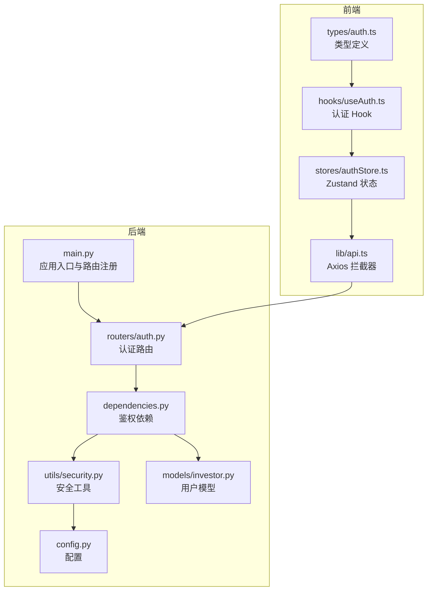
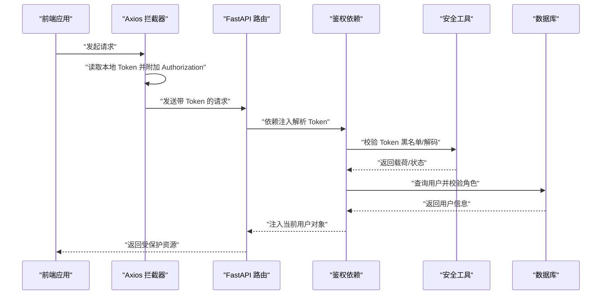
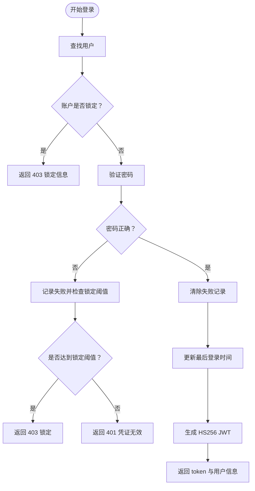
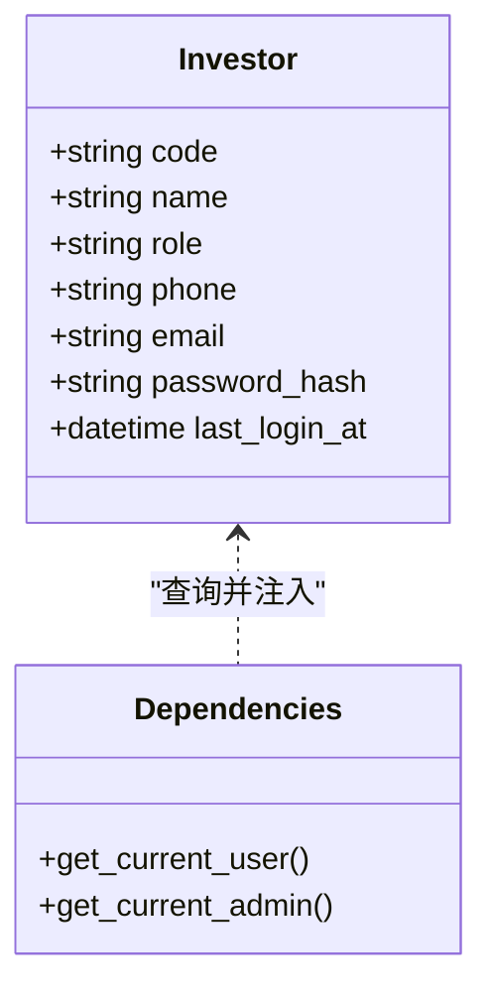
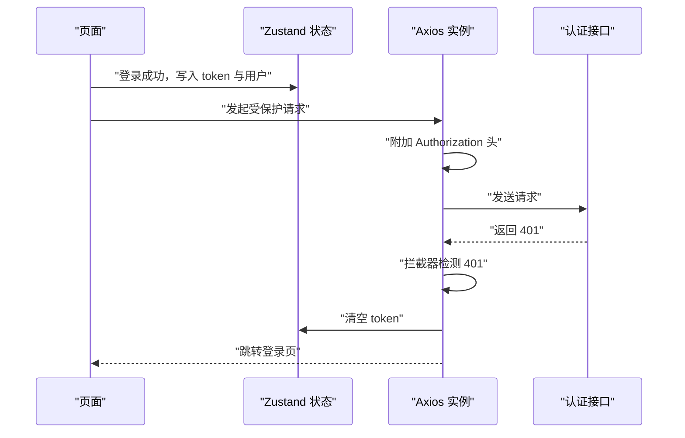
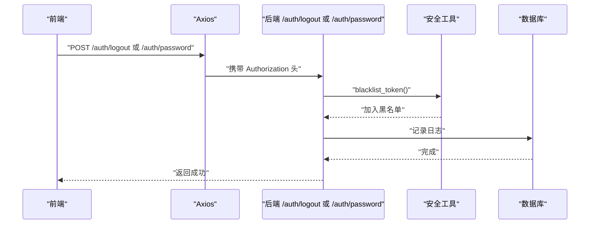
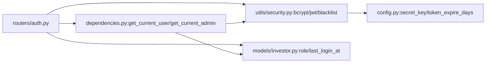

# 认证与安全

<cite>
**本文引用的文件**   
- [backend/app/routers/auth.py](file://backend/app/routers/auth.py)
- [backend/app/schemas/auth.py](file://backend/app/schemas/auth.py)
- [backend/app/utils/security.py](file://backend/app/utils/security.py)
- [backend/app/dependencies.py](file://backend/app/dependencies.py)
- [backend/app/models/investor.py](file://backend/app/models/investor.py)
- [backend/app/config.py](file://backend/app/config.py)
- [backend/app/main.py](file://backend/app/main.py)
- [frontend/src/lib/api.ts](file://frontend/src/lib/api.ts)
- [frontend/src/stores/authStore.ts](file://frontend/src/stores/authStore.ts)
- [frontend/src/hooks/useAuth.ts](file://frontend/src/hooks/useAuth.ts)
- [frontend/src/types/auth.ts](file://frontend/src/types/auth.ts)
- [Docs/04-后端开发.md](file://Docs/04-后端开发.md)
</cite>

## 目录
1. [简介](#简介)
2. [项目结构](#项目结构)
3. [核心组件](#核心组件)
4. [架构总览](#架构总览)
5. [详细组件分析](#详细组件分析)
6. [依赖分析](#依赖分析)
7. [性能考虑](#性能考虑)
8. [故障排查指南](#故障排查指南)
9. [结论](#结论)
10. [附录](#附录)

## 简介
本文件面向安全管理员与开发者，系统化梳理 InvestRing 的认证与安全体系，覆盖以下主题：
- HMAC Token 认证机制的实现原理、安全策略与使用方法
- 用户角色权限系统（admin/viewer）与访问控制
- 密码哈希存储、会话管理与安全最佳实践
- 前端认证状态管理、Token 刷新与安全存储策略
- 安全威胁分析、防护措施与应急响应方案
- 认证流程图与安全架构图

## 项目结构
后端采用 FastAPI + SQLAlchemy 架构，认证与安全相关代码主要分布在：
- 路由层：认证接口与权限依赖注入
- 工具层：密码哈希、Token 编解码、黑名单与失败追踪
- 模型层：用户实体与角色字段
- 配置层：密钥与 Token 有效期
- 前端：Axios 拦截器、Zustand 状态管理、React Hooks

**图表来源**
- [backend/app/main.py:17-53](file://backend/app/main.py#L17-L53)
- [backend/app/routers/auth.py:1-186](file://backend/app/routers/auth.py#L1-L186)
- [backend/app/dependencies.py:1-146](file://backend/app/dependencies.py#L1-L146)
- [backend/app/utils/security.py:1-103](file://backend/app/utils/security.py#L1-L103)
- [backend/app/models/investor.py:1-17](file://backend/app/models/investor.py#L1-L17)
- [backend/app/config.py:1-37](file://backend/app/config.py#L1-L37)
- [frontend/src/lib/api.ts:1-627](file://frontend/src/lib/api.ts#L1-L627)
- [frontend/src/stores/authStore.ts:1-71](file://frontend/src/stores/authStore.ts#L1-L71)
- [frontend/src/hooks/useAuth.ts:1-134](file://frontend/src/hooks/useAuth.ts#L1-L134)
- [frontend/src/types/auth.ts:1-23](file://frontend/src/types/auth.ts#L1-L23)

**章节来源**
- [backend/app/main.py:17-53](file://backend/app/main.py#L17-L53)
- [frontend/src/lib/api.ts:41-80](file://frontend/src/lib/api.ts#L41-L80)
- [frontend/src/stores/authStore.ts:18-71](file://frontend/src/stores/authStore.ts#L18-L71)

## 核心组件
- 认证路由与控制器：登录、登出、改密
- 鉴权依赖：提取 Token、黑名单校验、账户锁定检查、角色校验
- 安全工具：bcrypt 密码哈希、HS256 JWT 编解码、Token 黑名单、登录失败追踪
- 用户模型：角色字段 role（admin/viewer）、密码哈希、最后登录时间
- 配置：secret_key、token_expire_days
- 前端拦截器：自动附加 Authorization 头、401 统一处理、本地存储 Token

**章节来源**
- [backend/app/routers/auth.py:29-186](file://backend/app/routers/auth.py#L29-L186)
- [backend/app/dependencies.py:49-146](file://backend/app/dependencies.py#L49-L146)
- [backend/app/utils/security.py:15-103](file://backend/app/utils/security.py#L15-L103)
- [backend/app/models/investor.py:8-16](file://backend/app/models/investor.py#L8-L16)
- [backend/app/config.py:14-16](file://backend/app/config.py#L14-L16)
- [frontend/src/lib/api.ts:50-79](file://frontend/src/lib/api.ts#L50-L79)
- [frontend/src/stores/authStore.ts:37-51](file://frontend/src/stores/authStore.ts#L37-L51)

## 架构总览
下图展示认证与安全的整体交互：前端通过 Axios 发起请求，自动附加 Bearer Token；后端依赖解析 Token、校验黑名单与账户锁定状态；用户模型承载角色字段，配合依赖注入实现权限控制。

**图表来源**
- [frontend/src/lib/api.ts:50-79](file://frontend/src/lib/api.ts#L50-L79)
- [backend/app/dependencies.py:49-112](file://backend/app/dependencies.py#L49-L112)
- [backend/app/utils/security.py:29-47](file://backend/app/utils/security.py#L29-L47)
- [backend/app/models/investor.py:8-16](file://backend/app/models/investor.py#L8-L16)

## 详细组件分析

### HMAC Token 认证机制
- Token 类型与算法
  - 使用 HS256 对称签名的 JWT，包含 sub（用户编码）、role（角色）、exp（过期时间）等声明。
  - 过期时间由配置项 token_expire_days 决定，默认 7 天。
- 生成与校验流程
  - 生成：将载荷与 exp 合并后使用 secret_key 进行 HS256 编码。
  - 校验：解码载荷，检查是否存在、是否过期、是否在黑名单。
- 黑名单策略
  - 登出时将当前 Token 加入内存集合；后续请求若命中黑名单则拒绝。
  - 修改密码后同样将 Token 加入黑名单，强制重新登录。
- 登录失败与账户锁定
  - 连续失败 5 次，账户锁定 15 分钟；期间返回 403 并携带锁定截止时间。
- 登录日志
  - 成功/失败均记录到登录日志表，便于审计与风控。

**图表来源**
- [backend/app/routers/auth.py:29-96](file://backend/app/routers/auth.py#L29-L96)
- [backend/app/utils/security.py:29-38](file://backend/app/utils/security.py#L29-L38)
- [backend/app/utils/security.py:57-81](file://backend/app/utils/security.py#L57-L81)

**章节来源**
- [backend/app/routers/auth.py:29-96](file://backend/app/routers/auth.py#L29-L96)
- [backend/app/utils/security.py:15-103](file://backend/app/utils/security.py#L15-L103)
- [backend/app/config.py:14-16](file://backend/app/config.py#L14-L16)

### 用户角色权限系统（admin/viewer）
- 角色字段
  - 用户模型 role 默认 viewer，admin 为管理员角色。
- 权限控制
  - get_current_user：校验 Token、黑名单、账户锁定、用户存在性。
  - get_current_admin：在 get_current_user 基础上进一步校验角色为 admin。
- 访问限制
  - 文档中明确“除登录外所有接口需认证”，admin 可访问全部接口，viewer 仅能访问查询类接口（具体受各路由装饰器约束）。

**图表来源**
- [backend/app/models/investor.py:8-16](file://backend/app/models/investor.py#L8-L16)
- [backend/app/dependencies.py:49-129](file://backend/app/dependencies.py#L49-L129)

**章节来源**
- [backend/app/models/investor.py:8-16](file://backend/app/models/investor.py#L8-L16)
- [backend/app/dependencies.py:114-129](file://backend/app/dependencies.py#L114-L129)
- [Docs/04-后端开发.md:50-69](file://Docs/04-后端开发.md#L50-L69)

### 密码哈希存储、会话管理与安全最佳实践
- 密码存储
  - bcrypt 哈希，盐值轮数 12，确保抗彩虹表与暴力破解能力。
- 会话管理
  - 无服务端会话状态：基于 Token 的无状态认证。
  - Token 黑名单：登出与改密后主动失效，避免长期有效 Token 滥用。
- 最佳实践
  - 生产环境必须更换默认 secret_key，妥善保管。
  - 建议启用 HTTPS、设置安全的 Cookie 属性（如 SameSite、Secure、HttpOnly）。
  - 定期轮换密钥并迁移旧 Token。

**章节来源**
- [backend/app/utils/security.py:22-26](file://backend/app/utils/security.py#L22-L26)
- [backend/app/utils/security.py:53-54](file://backend/app/utils/security.py#L53-L54)
- [backend/app/config.py:14-16](file://backend/app/config.py#L14-L16)

### 前端认证状态管理、Token 刷新与安全存储策略
- 状态管理
  - Zustand 存储 token、用户信息与认证状态；持久化仅保存 token 与用户基本信息。
- 安全存储
  - 同时写入 localStorage 与 Cookie，并设置过期时间（Cookie 7 天）。
- 请求拦截
  - 自动在请求头附加 Authorization: Bearer token。
  - 401 统一处理：清空本地 token 并跳转登录页。
- Token 刷新
  - 当前实现未内置自动刷新；建议在过期前主动轮换或结合后端短期 Token 与刷新令牌方案。

**图表来源**
- [frontend/src/stores/authStore.ts:37-51](file://frontend/src/stores/authStore.ts#L37-L51)
- [frontend/src/lib/api.ts:50-79](file://frontend/src/lib/api.ts#L50-L79)

**章节来源**
- [frontend/src/stores/authStore.ts:18-71](file://frontend/src/stores/authStore.ts#L18-L71)
- [frontend/src/lib/api.ts:50-79](file://frontend/src/lib/api.ts#L50-L79)
- [frontend/src/hooks/useAuth.ts:11-134](file://frontend/src/hooks/useAuth.ts#L11-L134)

### 登出与改密流程
- 登出
  - 从请求头提取 Token 并加入黑名单，同时记录登出日志。
- 改密
  - 权限校验：admin 可改任意用户密码；viewer 仅能改自己且需旧密码验证。
  - 成功后将当前 Token 加入黑名单，强制重新登录。

**图表来源**
- [backend/app/routers/auth.py:98-186](file://backend/app/routers/auth.py#L98-L186)
- [backend/app/utils/security.py:53-54](file://backend/app/utils/security.py#L53-L54)

**章节来源**
- [backend/app/routers/auth.py:98-186](file://backend/app/routers/auth.py#L98-L186)
- [backend/app/utils/security.py:53-54](file://backend/app/utils/security.py#L53-L54)

## 依赖分析
- 路由依赖
  - /auth/login：依赖 get_db、IP/User-Agent 提取、登录日志记录、bcrypt 密码校验、HS256 Token 生成。
  - /auth/logout：依赖 get_current_user、security 解析、blacklist_token、登录日志记录。
  - /auth/password：依赖 get_current_user、权限校验、bcrypt 密码校验、HS256 Token 黑名单。
- 依赖注入
  - get_current_user：Token 黑名单、解码、账户锁定、用户查询。
  - get_current_admin：在 get_current_user 基础上校验角色。
- 配置
  - secret_key、token_expire_days 控制 Token 安全与有效期。

**图表来源**
- [backend/app/routers/auth.py:15-21](file://backend/app/routers/auth.py#L15-L21)
- [backend/app/dependencies.py:49-129](file://backend/app/dependencies.py#L49-L129)
- [backend/app/utils/security.py:29-38](file://backend/app/utils/security.py#L29-L38)
- [backend/app/models/investor.py:8-16](file://backend/app/models/investor.py#L8-L16)
- [backend/app/config.py:14-16](file://backend/app/config.py#L14-L16)

**章节来源**
- [backend/app/routers/auth.py:15-21](file://backend/app/routers/auth.py#L15-L21)
- [backend/app/dependencies.py:49-129](file://backend/app/dependencies.py#L49-L129)
- [backend/app/utils/security.py:29-38](file://backend/app/utils/security.py#L29-L38)

## 性能考虑
- Token 校验开销
  - HS256 解码与黑名单查询均为常数时间操作，性能开销极低。
- bcrypt 哈希
  - 轮数 12 已提供良好安全性与可接受的验证延迟。
- 登录失败追踪
  - 内存字典结构，单机部署下查询与更新为 O(1)，适合中小规模并发。
- 建议
  - 高并发场景可考虑引入 Redis 缓存 Token 黑名单与失败计数，或拆分服务节点并共享状态。

[本节为通用性能讨论，不直接分析具体文件]

## 故障排查指南
- 401 未授权
  - 检查前端是否正确附加 Authorization 头；确认 token 未过期且未被加入黑名单。
- 403 禁止访问
  - 检查用户角色是否满足接口权限要求；确认账户未被锁定。
- 登录失败锁定
  - 查看登录失败追踪状态，等待锁定时间结束或联系管理员解锁。
- 登出/改密后仍可访问
  - 确认后端已将 Token 加入黑名单；前端本地 token 是否被清理。
- 前端 401 自动跳转
  - Axios 拦截器已处理 401 清理本地 token 并跳转登录页，检查网络与跨域配置。

**章节来源**
- [frontend/src/lib/api.ts:67-79](file://frontend/src/lib/api.ts#L67-L79)
- [backend/app/dependencies.py:58-111](file://backend/app/dependencies.py#L58-L111)
- [backend/app/utils/security.py:57-103](file://backend/app/utils/security.py#L57-L103)

## 结论
InvestRing 的认证与安全体系以 HS256 JWT 为核心，结合 bcrypt 密码哈希、Token 黑名单与账户锁定机制，实现了基础而有效的无状态认证。前端通过 Axios 拦截器与 Zustand 状态管理，提供了简洁一致的认证体验。建议在生产环境中强化密钥管理、启用 HTTPS 与安全 Cookie、并考虑引入更完善的 Token 刷新与多设备会话管理策略。

[本节为总结性内容，不直接分析具体文件]

## 附录

### 安全威胁与防护
- 威胁
  - Token 泄露、重放攻击、暴力破解、账户锁定滥用。
- 防护
  - 强制 HTTPS、安全 Cookie、短 Token 有效期、失败锁定、黑名单、审计日志。
  - 生产环境替换默认密钥，定期轮换。

[本节为通用安全建议，不直接分析具体文件]

### 应急响应方案
- 密钥泄露
  - 立即轮换 secret_key，重建受影响用户的密码哈希与 Token。
- 大规模账户异常
  - 启用全局锁定策略，限制登录尝试，核查登录日志。
- 前端本地存储风险
  - 强制使用 HttpOnly Cookie（建议）与最小权限存储，定期清理本地缓存。

[本节为通用应急建议，不直接分析具体文件]