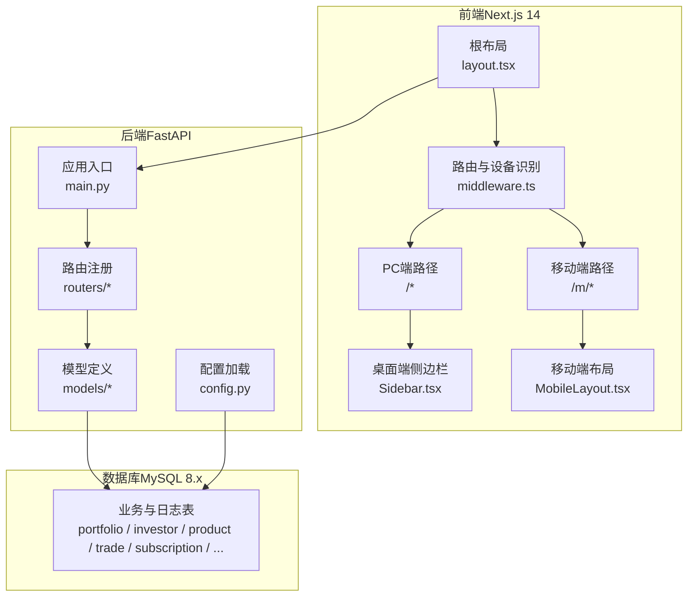
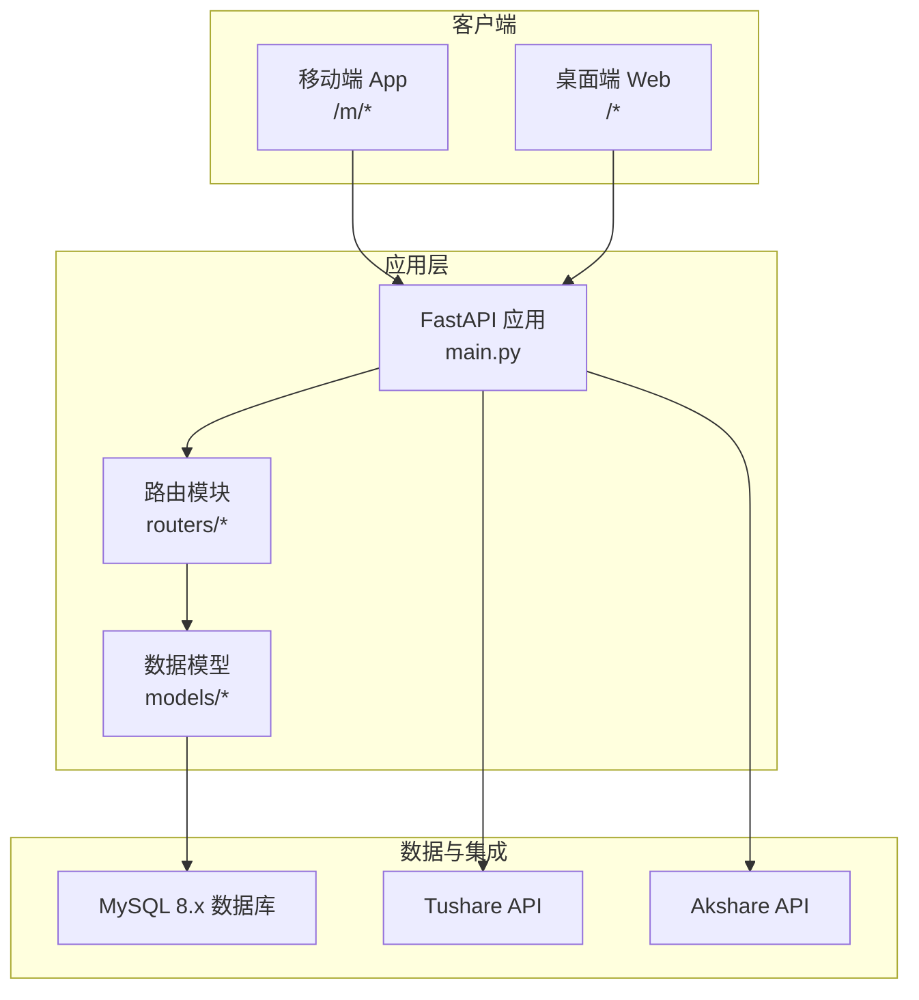
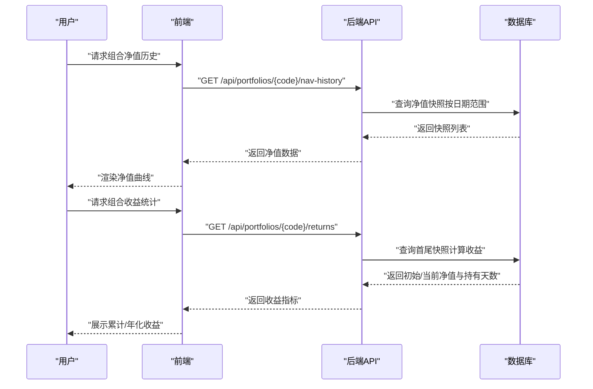
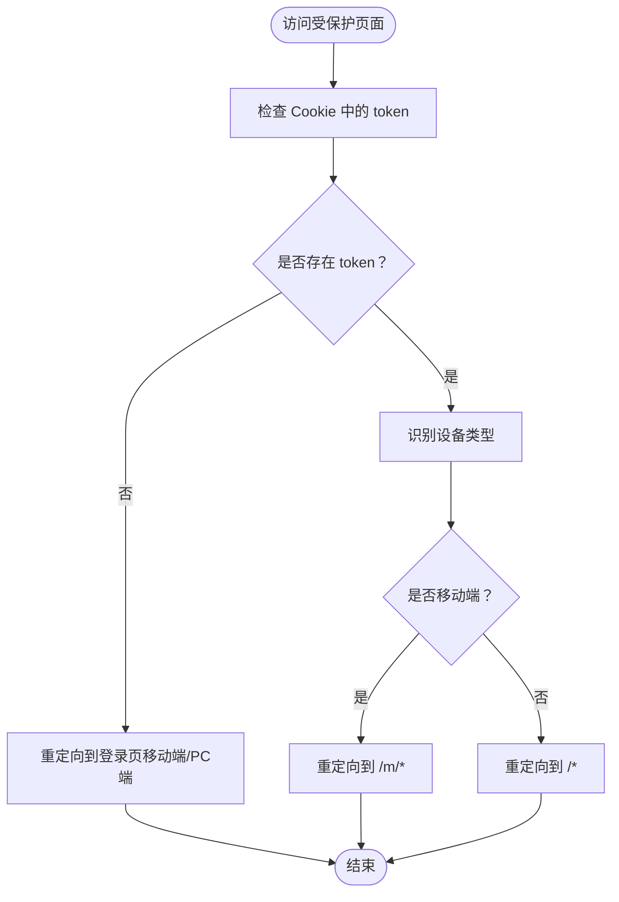
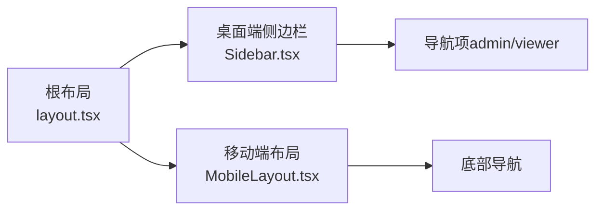
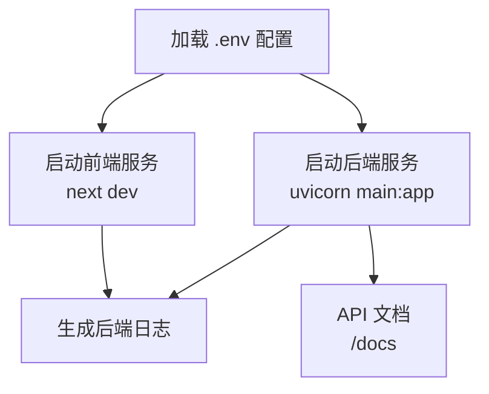
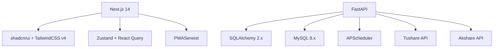

# 项目概述

<cite>
**本文引用的文件**
- [Docs/00-开发总览.md](file://Docs/00-开发总览.md)
- [Docs/01-产品需求.md](file://Docs/01-产品需求.md)
- [Docs/02-数据库设计.md](file://Docs/02-数据库设计.md)
- [backend/app/main.py](file://backend/app/main.py)
- [backend/app/config.py](file://backend/app/config.py)
- [backend/app/models/portfolio.py](file://backend/app/models/portfolio.py)
- [backend/app/models/investor.py](file://backend/app/models/investor.py)
- [backend/app/routers/portfolios.py](file://backend/app/routers/portfolios.py)
- [frontend/src/app/layout.tsx](file://frontend/src/app/layout.tsx)
- [frontend/src/components/desktop/Sidebar.tsx](file://frontend/src/components/desktop/Sidebar.tsx)
- [frontend/src/components/mobile/MobileLayout.tsx](file://frontend/src/components/mobile/MobileLayout.tsx)
- [frontend/src/middleware.ts](file://frontend/src/middleware.ts)
- [start.sh](file://start.sh)
- [package.json](file://package.json)
- [backend/requirements.txt](file://backend/requirements.txt)
</cite>

## 目录
1. [简介](#简介)
2. [项目结构](#项目结构)
3. [核心组件](#核心组件)
4. [架构总览](#架构总览)
5. [详细组件分析](#详细组件分析)
6. [依赖分析](#依赖分析)
7. [性能考虑](#性能考虑)
8. [故障排查指南](#故障排查指南)
9. [结论](#结论)
10. [附录](#附录)

## 简介
InvestRing（投资年轮）是一个面向大家庭的家庭投资组合管理系统，核心目标是帮助多投资人共同管理多个投资组合，提供净值化管理、多投资人份额分账、移动端与 PC 端双端独立体验，并通过标准化的数据源与任务机制实现自动化净值同步与计算。

- 核心理念：以“净值化”为中心，围绕组合、投资人、产品、交易与份额变动事件构建闭环；强调“快照记录历史、实时计算可用性”的设计原则。
- 目标用户：家庭/小团队多账户使用者，管理员负责组合与产品维护，普通查看者仅限查看。
- 使用场景：日常组合净值曲线跟踪、资金进出与调仓、份额变动事件处理、资产配置与收益统计、系统日志与任务管理。

## 项目结构
项目采用前后端分离架构，后端基于 FastAPI，前端基于 Next.js 14 App Router，移动端与 PC 端页面独立，通过中间件自动识别设备并路由至对应路径。

**图表来源**
- [frontend/src/app/layout.tsx:1-32](file://frontend/src/app/layout.tsx#L1-L32)
- [frontend/src/middleware.ts:1-40](file://frontend/src/middleware.ts#L1-L40)
- [frontend/src/components/desktop/Sidebar.tsx:1-147](file://frontend/src/components/desktop/Sidebar.tsx#L1-L147)
- [frontend/src/components/mobile/MobileLayout.tsx:1-16](file://frontend/src/components/mobile/MobileLayout.tsx#L1-L16)
- [backend/app/main.py:1-53](file://backend/app/main.py#L1-L53)
- [backend/app/config.py:1-37](file://backend/app/config.py#L1-L37)

**章节来源**
- [Docs/00-开发总览.md:16-33](file://Docs/00-开发总览.md#L16-L33)
- [frontend/src/middleware.ts:1-40](file://frontend/src/middleware.ts#L1-L40)
- [backend/app/main.py:1-53](file://backend/app/main.py#L1-L53)

## 核心组件
- 组合管理：支持组合创建、状态管理（草稿/运行中/已关闭）、净值历史查询、收益统计与资金流统计。
- 投资人管理：支持角色（admin/viewer）与权限控制，登录认证采用 HMAC Token（7天有效期）。
- 产品与市场数据：支持 ETF/OEF/LOF/CASH 等产品类型，对接 Tushare/Akshare 获取净值/价格，支持确认周期与 QDII 净值回溯。
- 交易与份额：支持申购赎回与调仓交易，严格区分“冻结”与“确认”，确保可用资金与份额的实时计算。
- 份额变动事件：支持现金分红、再投资分红、拆分、合并、送股等事件，保证份额与现金的准确记录。
- 快照体系：每日生成组合市值快照与投资人份额快照，历史不可篡改，配合实时计算保障准确性。
- 日志与任务：内置登录日志、审计日志、系统错误日志、定时任务与执行日志，支持交易日历同步与净值同步等核心任务。

**章节来源**
- [Docs/00-开发总览.md:75-91](file://Docs/00-开发总览.md#L75-L91)
- [Docs/01-产品需求.md:33-76](file://Docs/01-产品需求.md#L33-L76)
- [Docs/02-数据库设计.md:498-560](file://Docs/02-数据库设计.md#L498-L560)

## 架构总览
系统采用“前端双端 + 后端 API + 外部数据源”的三层架构。前端通过 Next.js 提供移动端与 PC 端独立页面，后端通过 FastAPI 提供 REST API，数据库采用 MySQL 8.x，外部数据源包括 Tushare 与 Akshare。

**图表来源**
- [Docs/00-开发总览.md:18-33](file://Docs/00-开发总览.md#L18-L33)
- [backend/app/main.py:17-48](file://backend/app/main.py#L17-L48)
- [backend/app/config.py:5-36](file://backend/app/config.py#L5-L36)

## 详细组件分析

### 组件A：组合管理（Portfolio）
- 职责：组合的创建、状态变更（关闭/重新激活）、净值历史查询、收益统计、资金流统计。
- 关键流程：关闭组合前检查待处理交易；净值历史按日期排序返回；收益统计包含累计收益率与年化收益率；资金流统计区分申购与赎回。
- 数据模型：Portfolio、PortfolioValueSnapshot、Subscription、Trade、InvestorHolding 等。

**图表来源**
- [backend/app/routers/portfolios.py:159-241](file://backend/app/routers/portfolios.py#L159-L241)
- [backend/app/models/portfolio.py:1-16](file://backend/app/models/portfolio.py#L1-L16)

**章节来源**
- [backend/app/routers/portfolios.py:18-276](file://backend/app/routers/portfolios.py#L18-L276)
- [backend/app/models/portfolio.py:1-16](file://backend/app/models/portfolio.py#L1-L16)

### 组件B：投资人与权限控制（Investor + Middleware）
- 职责：投资人 CRUD、角色（admin/viewer）与权限控制；前端中间件根据设备与登录态自动跳转至移动端或 PC 端登录页。
- 设计要点：所有用户必须设置密码；viewer 角色仅允许查看；admin 角色具备完整操作权限；登录使用 HMAC Token（7天有效期）。

**图表来源**
- [frontend/src/middleware.ts:1-40](file://frontend/src/middleware.ts#L1-L40)
- [backend/app/models/investor.py:1-17](file://backend/app/models/investor.py#L1-L17)

**章节来源**
- [frontend/src/middleware.ts:1-40](file://frontend/src/middleware.ts#L1-L40)
- [backend/app/models/investor.py:1-17](file://backend/app/models/investor.py#L1-L17)

### 组件C：双端布局与导航
- 职责：桌面端侧边栏根据角色显示不同菜单项；移动端底部导航与主内容区域布局。
- 设计要点：桌面端支持侧边栏折叠；移动端提供统一的主内容区与底部导航。

**图表来源**
- [frontend/src/components/desktop/Sidebar.tsx:29-43](file://frontend/src/components/desktop/Sidebar.tsx#L29-L43)
- [frontend/src/components/desktop/Sidebar.tsx:45-147](file://frontend/src/components/desktop/Sidebar.tsx#L45-L147)
- [frontend/src/components/mobile/MobileLayout.tsx:1-16](file://frontend/src/components/mobile/MobileLayout.tsx#L1-L16)
- [frontend/src/app/layout.tsx:1-32](file://frontend/src/app/layout.tsx#L1-L32)

**章节来源**
- [frontend/src/components/desktop/Sidebar.tsx:1-147](file://frontend/src/components/desktop/Sidebar.tsx#L1-L147)
- [frontend/src/components/mobile/MobileLayout.tsx:1-16](file://frontend/src/components/mobile/MobileLayout.tsx#L1-L16)
- [frontend/src/app/layout.tsx:1-32](file://frontend/src/app/layout.tsx#L1-L32)

### 组件D：系统配置与部署
- 职责：后端配置加载（数据库、安全、Tushare Token 等）；一键启动脚本自动安装依赖并启动前后端服务。
- 部署要点：后端使用 uvicorn，前端使用 Next.js dev；日志输出到 logs 目录；API 文档可通过 /docs 访问。

**图表来源**
- [backend/app/config.py:5-36](file://backend/app/config.py#L5-L36)
- [start.sh:22-77](file://start.sh#L22-L77)

**章节来源**
- [backend/app/config.py:1-37](file://backend/app/config.py#L1-L37)
- [start.sh:1-93](file://start.sh#L1-L93)

## 依赖分析
- 前端技术栈：Next.js 14 + App Router、shadcn/ui + TailwindCSS v4、Zustand + React Query、PWA（Serwist）。
- 后端技术栈：FastAPI、SQLAlchemy 2.x、MySQL 8.x、HMAC Token 认证、APScheduler 定时任务。
- 外部依赖：Tushare API、Akshare API。
- 依赖安装：前端通过 npm 安装依赖；后端通过 pip 安装 requirements.txt 中的包。

**图表来源**
- [Docs/00-开发总览.md:35-46](file://Docs/00-开发总览.md#L35-L46)
- [package.json:1-14](file://package.json#L1-L14)
- [backend/requirements.txt:1-19](file://backend/requirements.txt#L1-L19)

**章节来源**
- [Docs/00-开发总览.md:35-46](file://Docs/00-开发总览.md#L35-L46)
- [package.json:1-14](file://package.json#L1-L14)
- [backend/requirements.txt:1-19](file://backend/requirements.txt#L1-L19)

## 性能考虑
- 快照与实时计算分离：快照记录历史状态，所有可用资金/份额必须实时计算，避免陈旧数据导致的错误判断。
- 并发与锁：数据库采用 WAL 模式提升读写并发，适合“读多写少”的场景；定时任务与手动操作建议通过任务调度器串行化，避免竞争。
- 前端渲染：桌面端侧边栏支持折叠，移动端提供底部导航，减少重复渲染与布局抖动。
- 网络与缓存：HMAC Token 有效期为 7 天，合理利用缓存与本地状态管理降低网络请求频率。

**章节来源**
- [Docs/00-开发总览.md:129-137](file://Docs/00-开发总览.md#L129-L137)
- [Docs/02-数据库设计.md:624-655](file://Docs/02-数据库设计.md#L624-L655)

## 故障排查指南
- 登录与权限问题：确认已设置密码；检查 token 是否存在；移动端与 PC 端登录页路径是否正确。
- 移动端/PC 端跳转异常：检查中间件对设备的识别与路径重定向逻辑。
- 后端服务启动失败：检查 .env 配置（数据库、Tushare Token）；查看 logs/backend.log。
- 前端服务启动失败：检查 node/npm 环境；查看 logs/frontend.log。
- API 文档不可用：确认后端已启动并暴露 /docs。

**章节来源**
- [frontend/src/middleware.ts:1-40](file://frontend/src/middleware.ts#L1-L40)
- [start.sh:37-54](file://start.sh#L37-L54)
- [start.sh:72-77](file://start.sh#L72-L77)

## 结论
InvestRing 通过“净值化管理 + 多投资人份额分账 + 双端独立体验 + 自动化数据与任务”的设计，为家庭与小团队提供了稳定、可扩展的投资组合管理解决方案。其以快照与实时计算为核心的数据模型，结合严格的权限控制与日志体系，既满足初学者的易用性，也为进阶用户提供充分的技术细节与扩展空间。

## 附录

### 快速开始指南
- 环境准备：安装 Node.js 与 Python3。
- 安装依赖：前端执行 npm install；后端执行 pip install -r requirements.txt。
- 配置环境：准备 .env 文件，配置数据库与 Tushare Token。
- 启动服务：执行 ./start.sh，等待后端（http://localhost:8000）与前端（http://localhost:3000）启动。
- 访问系统：浏览器打开 http://localhost:3000，移动端访问 http://localhost:3000/m；登录后根据角色查看相应页面。

**章节来源**
- [start.sh:1-93](file://start.sh#L1-L93)
- [backend/requirements.txt:1-19](file://backend/requirements.txt#L1-L19)
- [package.json:1-14](file://package.json#L1-L14)